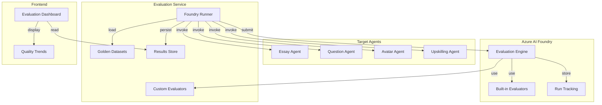
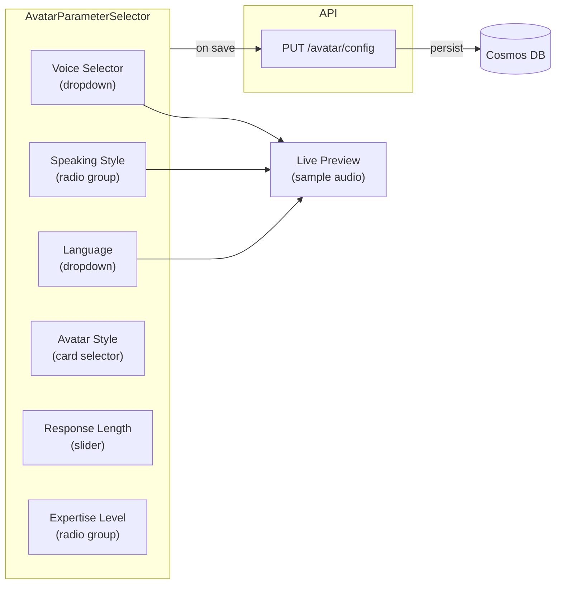

# Agent Evaluation

> How **The Tutor** uses Azure AI Foundry's Evaluation Engine to measure, track, and improve AI agent quality across all agentic services.

---

## 1. Why Agent Evaluation?

The platform relies on AI agents for critical educational tasks:

| Agent | Impact of Poor Quality |
|-------|----------------------|
| **Essay Evaluator** | Incorrect feedback → student learns wrong concepts |
| **Question Grader** | Wrong scores → unfair assessment |
| **Avatar Tutor** | Incoherent responses → student confusion |
| **Upskilling Coach** | Bad recommendations → wasted study time |

Without systematic evaluation, there is no way to:
- Detect **regression** when prompts, models, or configurations change
- Compare **agent variants** (e.g., gpt-4o vs. gpt-4o-mini for questions)
- Ensure **safety** (no harmful, biased, or inappropriate content)
- Demonstrate **quality to professors** before enabling agents for students

---

## 2. Evaluation Architecture



---

## 3. Built-in Evaluators

Azure AI Foundry provides these evaluators out of the box:

| Evaluator | Measures | Scale | Threshold |
|-----------|----------|-------|-----------|
| **Groundedness** | Is the response grounded in the provided context? | 1–5 | ≥ 4.0 |
| **Relevance** | Does the response address the actual question? | 1–5 | ≥ 4.0 |
| **Coherence** | Is the response logically structured? | 1–5 | ≥ 4.0 |
| **Fluency** | Is the language natural and grammatically correct? | 1–5 | ≥ 4.0 |
| **Similarity** | How close is the response to the expected output? | 0–1 | ≥ 0.7 |
| **F1 Score** | Token-level overlap with reference answer | 0–1 | ≥ 0.6 |
| **Content Safety** | No harmful, biased, or inappropriate content | Pass/Fail | Pass |

---

## 4. Custom Evaluators

Education-specific evaluators for The Tutor, aligned with the department's pedagogical standards:

### 4.1 Pedagogical Accuracy Evaluator

```python
# apps/evaluation/src/app/evaluators/pedagogical_accuracy.py
from azure.ai.evaluation import evaluate

class PedagogicalAccuracyEvaluator:
    """Evaluates whether the agent's feedback is pedagogically sound
    and aligned with official rubrics and curated materials."""
    
    def __init__(self, model_config):
        self.model_config = model_config
    
    def __call__(self, *, query: str, response: str, context: str) -> dict:
        prompt = f"""
        You are an expert education evaluator for a state education 
        department. Assess whether the following feedback is 
        pedagogically sound and supports student learning according to 
        official educational standards.
        
        Student submission: {query}
        Agent feedback: {response}
        Educational context: {context}
        
        Score on these dimensions (1-5):
        1. Constructive: Does the feedback help the student improve?
        2. Accurate: Is the subject-matter feedback correct per official rubrics?
        3. Encouraging: Does it maintain student motivation?
        4. Actionable: Does it provide specific steps for improvement?
        5. Grounded: Is the feedback grounded in the provided pedagogical materials?
        
        Return JSON: {{"constructive": N, "accurate": N, "encouraging": N, "actionable": N, "grounded": N}}
        """
        result = self._evaluate_with_llm(prompt)
        return {
            "pedagogical_accuracy": sum(result.values()) / len(result),
            **result
        }
```

### 4.2 Rubric Alignment Evaluator

```python
# apps/evaluation/src/app/evaluators/rubric_alignment.py
class RubricAlignmentEvaluator:
    """Evaluates whether the agent's scoring aligns with a provided rubric."""
    
    def __call__(self, *, query: str, response: str, rubric: str) -> dict:
        # Compare agent's dimension scores against rubric expectations
        ...
        return {
            "rubric_alignment": alignment_score,
            "dimension_deviations": deviations
        }
```

### 4.3 ENEM Competency Fidelity Evaluator (NEW — BN-PED-1)

```python
# apps/evaluation/src/app/evaluators/enem_fidelity.py
class ENEMFidelityEvaluator:
    """Evaluates whether the agent's essay scoring correctly applies
    ENEM Competencies I–V and produces scores consistent with 
    the official INEP rubric (0–200 per competency, 0–1000 composite)."""
    
    COMPETENCIES = [
        "I: Formal written Portuguese",
        "II: Theme comprehension and text type",
        "III: Information organization and argumentation",
        "IV: Linguistic cohesion mechanisms",
        "V: Intervention proposal respecting human rights",
    ]
    
    def __call__(self, *, query: str, response: str, expected_scores: dict) -> dict:
        # Parse agent's per-competency scores from response
        agent_scores = self._extract_scores(response)
        
        deviations = {}
        for comp in self.COMPETENCIES:
            key = comp.split(":")[0].strip()
            expected = expected_scores.get(key, 0)
            actual = agent_scores.get(key, 0)
            deviations[key] = abs(expected - actual)
        
        max_deviation = max(deviations.values())
        avg_deviation = sum(deviations.values()) / len(deviations)
        
        return {
            "enem_fidelity": 1.0 - (avg_deviation / 200),  # 0-1 scale
            "max_competency_deviation": max_deviation,
            "per_competency_deviations": deviations,
            "composite_deviation": abs(
                sum(expected_scores.values()) - sum(agent_scores.values())
            ),
        }
```

### 4.4 Discursive Question Accuracy Evaluator (NEW — BN-PED-1)

```python
# apps/evaluation/src/app/evaluators/discursive_accuracy.py
class DiscursiveAccuracyEvaluator:
    """Evaluates whether the agent correctly grades open-ended 
    discursive questions by comparing against expert-graded responses."""
    
    def __call__(self, *, query: str, response: str, 
                 expert_grade: dict, context: str) -> dict:
        prompt = f"""
        You are an expert evaluator for discursive question grading.
        Compare the AI grader's assessment against the expert-provided grade.
        
        Question: {query}
        AI grader feedback: {response}
        Expert grade: {expert_grade}
        Subject context: {context}
        
        Score on these dimensions (1-5):
        1. Grade accuracy: Does the AI grade match the expert grade?
        2. Justification quality: Is the grading rationale sound?
        3. Feedback specificity: Does it cite specific parts of the answer?
        
        Return JSON: {{"grade_accuracy": N, "justification_quality": N, "feedback_specificity": N}}
        """
        result = self._evaluate_with_llm(prompt)
        return {
            "discursive_accuracy": sum(result.values()) / len(result),
            **result
        }
```

### 4.5 Guardrail Compliance Evaluator (NEW — BN-PED-5)

```python
# apps/evaluation/src/app/evaluators/guardrail_compliance.py
class GuardrailComplianceEvaluator:
    """Evaluates whether the guided tutor (chat-svc) correctly enforces
    pedagogical guardrails: topic boundaries, language, no-direct-answers."""
    
    def __call__(self, *, conversation: list[dict], rules: dict) -> dict:
        violations = {
            "topic_violation": False,
            "direct_answer_given": False,
            "language_violation": False,
            "exceeded_turn_limit": len(conversation) > rules.get("max_turns", 20),
        }
        
        # LLM-as-judge checks each agent turn for violations
        for turn in conversation:
            if turn["role"] == "assistant":
                check = self._check_turn(turn["content"], rules)
                for key in violations:
                    violations[key] = violations[key] or check.get(key, False)
        
        compliance_score = 1.0 - (sum(violations.values()) / len(violations))
        return {
            "guardrail_compliance": compliance_score,
            "violations": violations,
        }
```

---

## 5. Golden Datasets

### 5.1 Dataset Schema

```json
{
    "id": "essay-golden-v1",
    "agentType": "essay_evaluator",
    "version": "1.0.0",
    "createdBy": "professor@university.edu",
    "createdAt": "2026-02-24T10:00:00Z",
    "description": "Golden dataset for analytical essay evaluation",
    "entries": [
        {
            "id": "entry-001",
            "input": "Analyze the impact of renewable energy adoption...",
            "context": "Graduate-level environmental science course, analytical essay format",
            "expected_output": "The essay demonstrates strong thesis development with ...",
            "metadata": {
                "strategy": "analytical",
                "difficulty": "advanced",
                "courseId": "ENV-501",
                "expectedDimensions": {
                    "thesis_clarity": 4,
                    "evidence_quality": 5,
                    "argumentation": 4,
                    "writing_quality": 3
                }
            }
        }
    ]
}
```

### 5.2 Recommended Dataset Sizes

| Agent Type | Minimum Entries | Recommended | Multi-turn |
|-----------|-----------------|-------------|------------|
| Essay Evaluator (analytical/narrative) | 15 | 30 | No |
| Essay Evaluator (ENEM) | 20 | 40 | No |
| Question Grader (objective) | 20 | 50 | No |
| Question Grader (discursive) | 15 | 30 | No |
| Avatar Tutor | 5 | 15 | Yes (3-5 turns each) |
| Guided Tutor (chat-svc) | 10 | 20 | Yes (5-10 turns each) |
| Upskilling Coach | 10 | 25 | No |
| Guardrail Compliance | 10 | 20 | Yes (adversarial + normal) |

---

## 6. Evaluation API

### Endpoints

```
POST   /api/evaluation/run                    # Start evaluation run
GET    /api/evaluation/runs                    # List all runs
GET    /api/evaluation/runs/{runId}            # Get run details
GET    /api/evaluation/runs/{runId}/results    # Get per-entry results
POST   /api/evaluation/datasets               # Create golden dataset
GET    /api/evaluation/datasets               # List datasets
GET    /api/evaluation/datasets/{id}          # Get dataset details
PUT    /api/evaluation/datasets/{id}          # Update dataset
DELETE /api/evaluation/datasets/{id}          # Delete dataset
GET    /api/evaluation/metrics/trends         # Quality trends over time
```

### Run Request

```json
{
    "agentId": "essay-evaluator-v2",
    "datasetId": "essay-golden-v1",
    "evaluators": ["groundedness", "relevance", "coherence", "fluency", "pedagogical_accuracy"],
    "config": {
        "model": "gpt-4o",
        "temperature": 0.0,
        "strategy": "analytical"
    }
}
```

### Run Response

```json
{
    "runId": "eval-run-20260224-001",
    "status": "completed",
    "agentId": "essay-evaluator-v2",
    "datasetId": "essay-golden-v1",
    "startedAt": "2026-02-24T10:00:00Z",
    "completedAt": "2026-02-24T10:05:23Z",
    "summary": {
        "totalEntries": 30,
        "passed": 27,
        "failed": 3,
        "metrics": {
            "groundedness": { "mean": 4.3, "min": 3.0, "max": 5.0, "stddev": 0.5 },
            "relevance": { "mean": 4.5, "min": 3.5, "max": 5.0, "stddev": 0.4 },
            "coherence": { "mean": 4.2, "min": 2.5, "max": 5.0, "stddev": 0.6 },
            "fluency": { "mean": 4.7, "min": 4.0, "max": 5.0, "stddev": 0.3 },
            "pedagogical_accuracy": { "mean": 4.1, "min": 3.0, "max": 5.0, "stddev": 0.5 }
        }
    },
    "thresholdResult": "PASS"
}
```

---

## 7. Avatar Parameter Configuration

The evaluation system also validates avatar configurations by testing different parameter combinations.

### 7.1 Parameter Schema

```typescript
// frontend/types/avatarConfig.ts
export interface AvatarConfig {
  id: string;
  courseId: string;
  voiceName: VoiceName;
  speakingStyle: SpeakingStyle;
  language: Language;
  avatarStyle: AvatarStyle;
  responseLength: ResponseLength;
  expertiseLevel: ExpertiseLevel;
}

export type VoiceName = "en-US-JennyNeural" | "en-US-GuyNeural" | "en-US-AriaNeural";
export type SpeakingStyle = "friendly" | "professional" | "empathetic";
export type Language = "en-US" | "pt-BR" | "es-ES";
export type AvatarStyle = "casual" | "formal" | "technical";
export type ResponseLength = "concise" | "detailed" | "comprehensive";
export type ExpertiseLevel = "beginner" | "intermediate" | "advanced";
```

### 7.2 Backend Reflection

When a student starts an avatar session, the Avatar Service loads the saved configuration:

```python
# apps/avatar/src/app/routes.py
@router.post("/session")
async def start_session(request: SessionRequest):
    # Load avatar config from Cosmos
    config = await avatar_config_repo.get(request.course_id)
    
    # Configure Speech SDK
    speech_config = speechsdk.SpeechConfig(...)
    speech_config.speech_synthesis_voice_name = config.voice_name
    speech_config.set_property("SpeechSynthesis-Style", config.speaking_style)
    
    # Configure agent system prompt
    system_prompt = build_system_prompt(
        style=config.avatar_style,
        expertise=config.expertise_level,
        max_tokens=RESPONSE_LENGTH_MAP[config.response_length],
    )
    
    return SessionResponse(session_id=session.id, config=config)
```

### 7.3 Frontend Selector



---

## 8. CI/CD Integration

### 8.1 Evaluation in Pull Requests

```yaml
# .github/workflows/evaluation.yml
name: Agent Evaluation
on:
  pull_request:
    branches: [main]
    paths:
      - 'apps/essays/**'
      - 'apps/questions/**'
      - 'apps/avatar/**'
      - 'apps/upskilling/**'
      - 'lib/**'

jobs:
  evaluate:
    runs-on: ubuntu-latest
    steps:
      - uses: actions/checkout@v4
      
      - name: Set up Python 3.13
        uses: actions/setup-python@v5
        with:
          python-version: '3.13'
      
      - name: Install dependencies
        run: |
                    python -m pip install --upgrade uv
                    uv pip install --system -e lib/
                    uv pip install --system -e apps/evaluation/
      
      - name: Run evaluation
        env:
          AZURE_AI_PROJECT_CONNECTION_STRING: ${{ secrets.AI_PROJECT_CONN }}
        run: |
          python -m evaluation.cli run \
            --agents essay-evaluator,question-grader \
            --threshold 4.0 \
            --output evaluation-results.json
      
      - name: Post results to PR
        uses: actions/github-script@v7
        with:
          script: |
            const results = require('./evaluation-results.json');
            const body = formatEvaluationResults(results);
            github.rest.issues.createComment({
              issue_number: context.issue.number,
              owner: context.repo.owner,
              repo: context.repo.repo,
              body
            });
```

### 8.2 Scheduled Evaluation

Run full evaluation suite nightly to detect drift:

```yaml
# .github/workflows/nightly-evaluation.yml
name: Nightly Agent Evaluation
on:
  schedule:
    - cron: '0 2 * * *'  # 2 AM UTC daily
```

---

## 9. Quality Dashboard Wireframe

```
┌──────────────────────────────────────────────────────────────┐
│ Agent Evaluation Dashboard                                    │
├──────────────────────────────────────────────────────────────┤
│                                                              │
│  Overall Health: ✅ PASSING (all agents above threshold)     │
│                                                              │
│  ┌─────────────────────────────────────────────────────────┐ │
│  │ Quality Trends (last 30 days)          📊 [chart area]  │ │
│  │                                                         │ │
│  │  Groundedness ━━━━━━━━━━━━━━━━━━━━━━━━━  4.3 ✅        │ │
│  │  Relevance    ━━━━━━━━━━━━━━━━━━━━━━━━━━ 4.5 ✅        │ │
│  │  Coherence    ━━━━━━━━━━━━━━━━━━━━━━━━━  4.2 ✅        │ │
│  │  Fluency      ━━━━━━━━━━━━━━━━━━━━━━━━━━━4.7 ✅        │ │
│  │  Safety       ━━━━━━━━━━━━━━━━━━━━━━━━━━━PASS ✅       │ │
│  └─────────────────────────────────────────────────────────┘ │
│                                                              │
│  Recent Runs                                                 │
│  ┌──────┬──────────────┬────────┬───────┬──────────────────┐ │
│  │ Date │ Agent        │ Status │ Score │ Dataset          │ │
│  ├──────┼──────────────┼────────┼───────┼──────────────────┤ │
│  │ 2/24 │ essay-eval   │ ✅     │ 4.3   │ essay-golden-v1  │ │
│  │ 2/24 │ question-eval│ ✅     │ 4.5   │ question-golden  │ │
│  │ 2/23 │ avatar-eval  │ ⚠️     │ 3.8   │ avatar-golden    │ │
│  │ 2/22 │ essay-eval   │ ✅     │ 4.4   │ essay-golden-v1  │ │
│  └──────┴──────────────┴────────┴───────┴──────────────────┘ │
└──────────────────────────────────────────────────────────────┘
```
