# Architecture

> Target architecture for **The Tutor** as a learner-record-centered lifelong-learning and outcomes platform. The platform preserves the repo's deterministic-core plus agentic-services split and evolves through Strangler Fig around the services and Azure topology already present in this repository.

---

## 1. High-Level System Context

Tutor is moving from an LMS enhancement layer to the institution-owned control plane for lifelong learning. Following DDD bounded contexts and TOGAF architecture building blocks, Tutor owns learner records, evidence, role-aware workflows, and credentials, while LMS, SIS, CRM, analytics, and wallet ecosystems remain external systems behind anti-corruption layers.

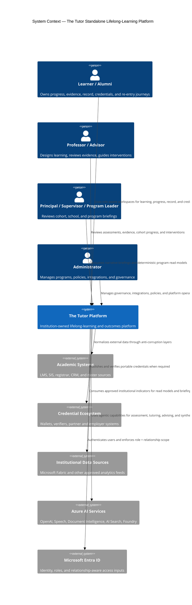

---

## 2. Target-State Control Plane and Bounded Contexts

The target state has four cooperating layers: a role-aware workspace shell, a deterministic control plane, bounded agentic services, and CQRS-style read models. The logical design changes now; the deployment substrate can remain APIM + ACA + Cosmos DB + Blob Storage + Azure AI while the migration proceeds.

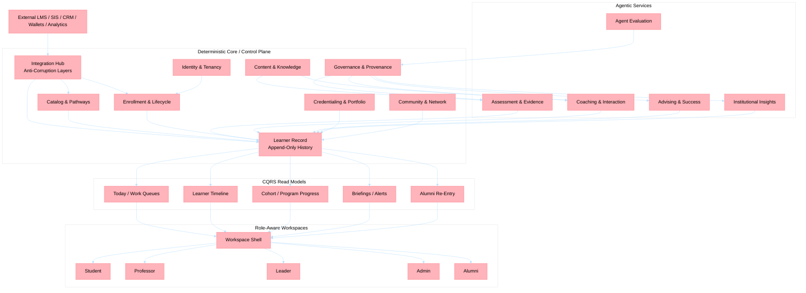

| Layer | Primary bounded contexts | Design intent | Current repo anchors |
| ----- | ------------------------ | ------------- | -------------------- |
| **Deterministic core** | Identity and Tenancy, Integration Hub, Catalog and Pathways, Enrollment and Lifecycle, Learner Record, Content and Knowledge, Credentialing and Portfolio, Community and Network, Governance and Provenance | Own institutional records, policies, lifecycle state, and provenance | `config-svc`, `lms-gateway`, `content-svc`, shared auth middleware, and future learner-record / credential contexts |
| **Agentic services** | Assessment and Evidence, Coaching and Interaction, Advising and Success, Institutional Insights, Agent Evaluation | Constrain probabilistic reasoning to high-value educational workflows | `essays-svc`, `questions-svc`, `avatar-svc`, `chat-svc`, `upskilling-svc`, `insights-svc`, `evaluation-svc` |
| **Read models** | Learner timeline, work queues, cohort and school projections, alumni re-entry views | Project append-only records into role-specific experiences | Existing dashboards plus future role-aware workspace shell |

### 2.1 Migration Horizons

| Horizon | Wave | Objective | Approved backlog alignment | Current repo implication |
| ------- | ---- | --------- | -------------------------- | ------------------------ |
| **H1: Record-First Overlay** | Wave 1 | Establish relationship-based access control, event backbone, provenance capture, learner-record MVP, and role-aware shell without breaking current enhancer flows. | LL-01, LL-02, LL-03, LL-04, LL-06, LL-18 | Existing services stay in place and begin writing governed learner-record events and projections. |
| **H2: Standalone Learning Core** | Wave 2 | Introduce deterministic advising, interventions, role workspaces, and institutional read models. | LL-05, LL-08, LL-09, LL-10, LL-11, LL-13, LL-17 | Current assessment, interaction, and insights services become the execution fabric behind role-specific workspaces and intervention flows. |
| **H3: Lifelong Network Platform** | Wave 3 | Add skills graph, credentialing, alumni re-entry, community, and continuing-education expansion. | LL-07, LL-12, LL-14, LL-15, LL-16 | New bounded contexts can start inside existing services or shared libraries and split only when ownership or scale justifies it. |

> Sections 3-8 describe the current Wave 1 runtime realization. They remain the implementation reference for the services already in the repo while the target bounded contexts above are introduced incrementally.

---

## 3. Service Interaction Flows

### 3.1 Essay Evaluation Flow (with OCR + ENEM)

> **Implementation status:**
>
> - Steps 1–4 (upload → Blob): ✅ Live
> - Steps 5–6 (OCR via Document Intelligence): 🔧 Phase A — branch `feat/ocr-essay-ingestion` (issue #18)
> - Steps 7–8 (RAG via AI Search): ⏳ Phase B (issue #19)
> - Steps 9 (ENEM strategy + Foundry evaluation): ⏳ Phase B

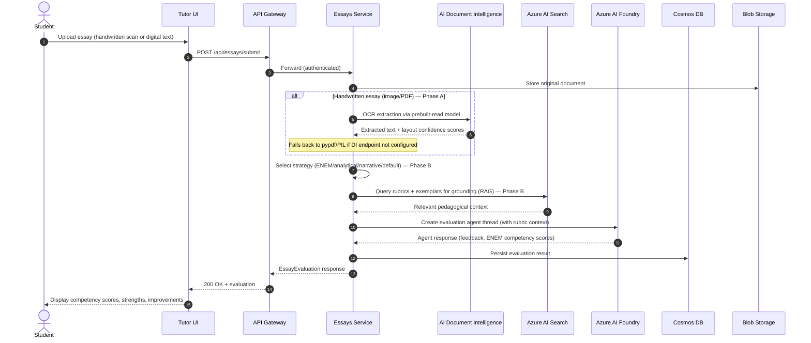

### 3.2 Question Evaluation Flow (State Machine)

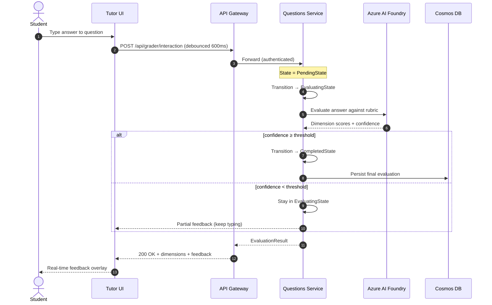

### 3.3 Avatar Interaction Flow

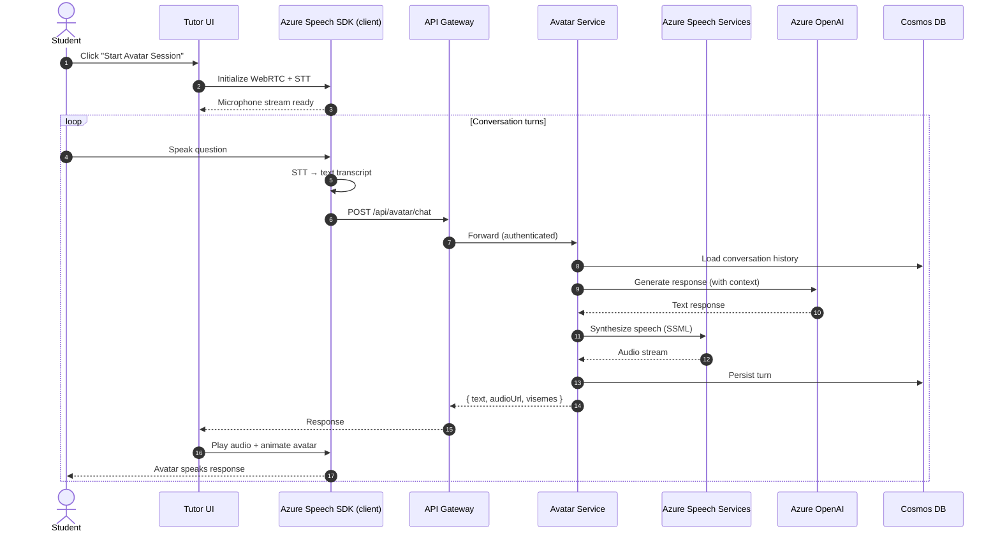

### 3.4 Upskilling Plan Management Flow

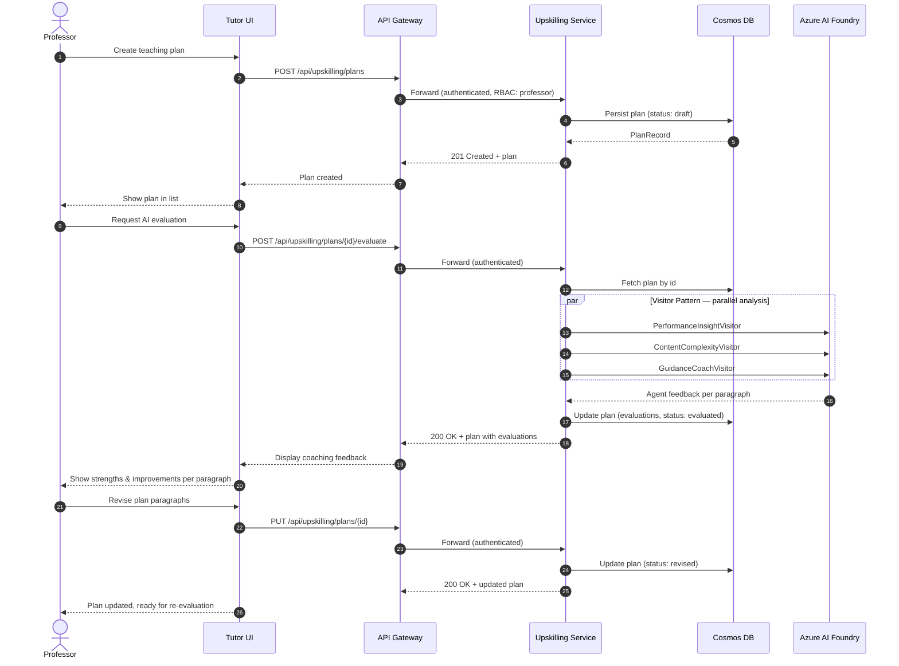

### 3.5 Configuration CRUD Flow

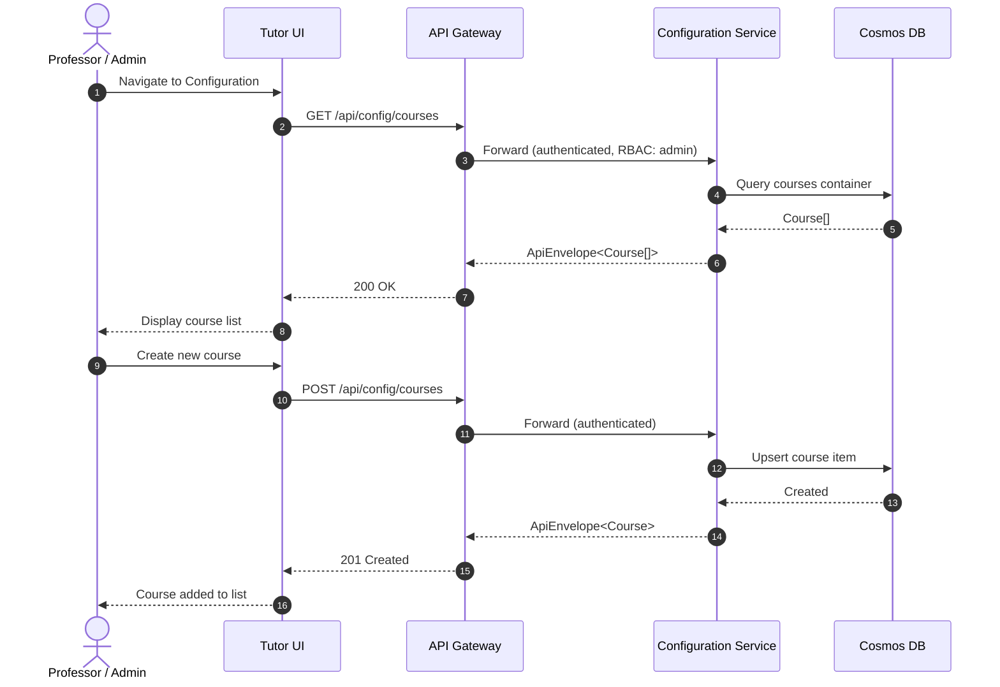

### 3.6 Agent Evaluation Flow (New)

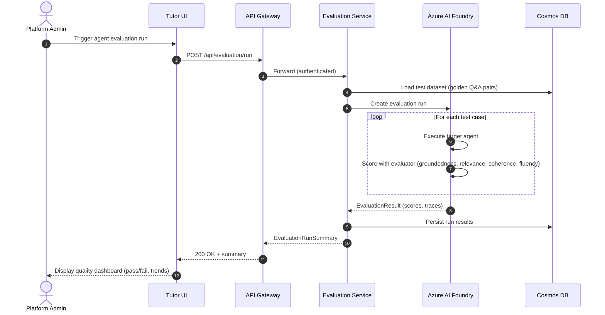

### 3.7 LMS Gateway Sync Flow (New)

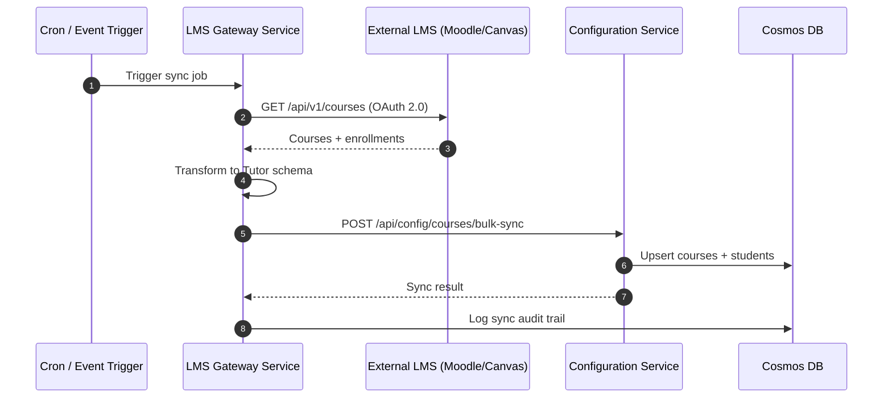

### 3.8 Supervisor Insight Report Flow (New)

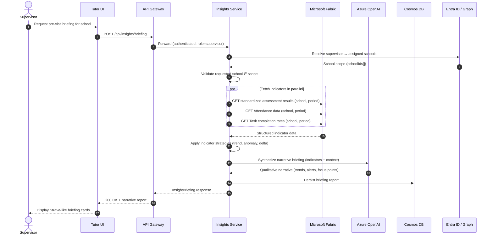

### 3.9 Pedagogical Content Ingestion Flow (New)

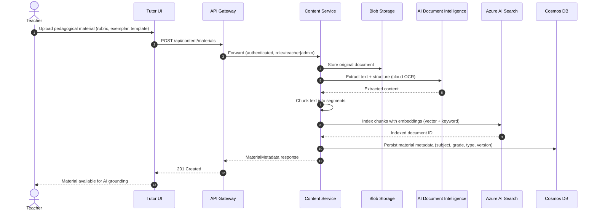

### 3.10 Guided Tutoring Flow (Chat Service)

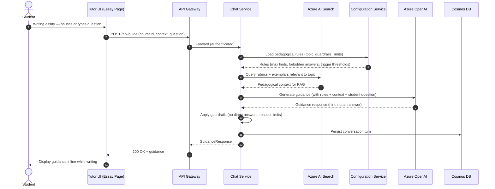

---

## 4. Deployment Topology (Current Runtime Substrate)

```mermaid
graph TB
    subgraph Azure["Azure Subscription"]
        subgraph RG["Resource Group: tutor-rg"]
            subgraph VNet["VNet (10.0.0.0/22)"]
                subgraph ACA_Subnet["ACA Subnet (10.0.0.0/23)"]
                    ACA_ENV["ACA Environment"]
                    
                    subgraph Platform["Platform Domain"]
                        CONFIG["config-svc"]
                        LMS_GW["lms-gateway"]
                        CONTENT["content-svc"]
                    end

                    subgraph Assessment["Assessment Domain"]
                        ESSAYS["essays-svc"]
                        QUESTIONS["questions-svc"]
                    end
                    
                    subgraph Interaction["Interaction Domain"]
                        AVATAR["avatar-svc"]
                        CHAT["chat-svc"]
                    end
                    
                    subgraph Analytics["Analytics Domain"]
                        UPSKILLING["upskilling-svc"]
                        EVALUATION["evaluation-svc"]
                    end

                    subgraph Supervision["Supervision Domain"]
                        INSIGHTS["insights-svc"]
                    end
                end
                
                subgraph PE_Subnet["Private Endpoints Subnet (10.0.2.0/24)"]
                    PE_COSMOS["PE: Cosmos DB"]
                    PE_OPENAI["PE: OpenAI"]
                    PE_SPEECH["PE: Speech"]
                    PE_BLOB["PE: Blob Storage"]
                    PE_KV["PE: Key Vault"]
                    PE_SEARCH["PE: AI Search"]
                    PE_DOCINTEL["PE: Document Intelligence"]
                end
            end
            
            COSMOS[("Cosmos DB — 5 databases")]
            OPENAI["Azure OpenAI"]
            SPEECH["Azure Speech"]
            BLOB["Blob Storage"]
            KV["Key Vault"]
            ACR["Container Registry"]
            LOG["Log Analytics"]
            APIM["API Management"]
            DOC_INTEL["AI Document Intelligence"]
            AI_SEARCH["Azure AI Search"]
        end
        
        FOUNDRY["AI Foundry Project\n(westus3, public endpoint,\nTerraform-managed — ADR-011)"]
        SWA["Static Web App (Frontend)"]
        ENTRA["Microsoft Entra ID"]
    end

    FABRIC["Microsoft Fabric\n(External Semantic Model)"]

    USER_S((Student)) --> SWA
    USER_T((Teacher)) --> SWA
    USER_SUP((Supervisor)) --> SWA
    SWA --> APIM
    APIM --> ACA_ENV

    INSIGHTS --> FABRIC
    
    PE_COSMOS --- COSMOS
    PE_OPENAI --- OPENAI
    PE_SPEECH --- SPEECH
    PE_BLOB --- BLOB
    PE_KV --- KV
    PE_SEARCH --- AI_SEARCH
    PE_DOCINTEL --- DOC_INTEL
    
    ACA_ENV --> ACR
    ACA_ENV --> LOG
```

---

## 5. Shared Library Architecture (Current Runtime)

Following the [holiday-peak-hub](https://github.com/Azure-Samples/holiday-peak-hub) reference, all services consume a shared `lib/` package.

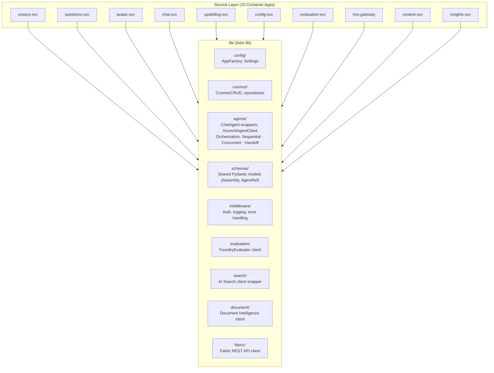

---

## 6. Wave 1 Data Model (Cosmos DB Partitioning)

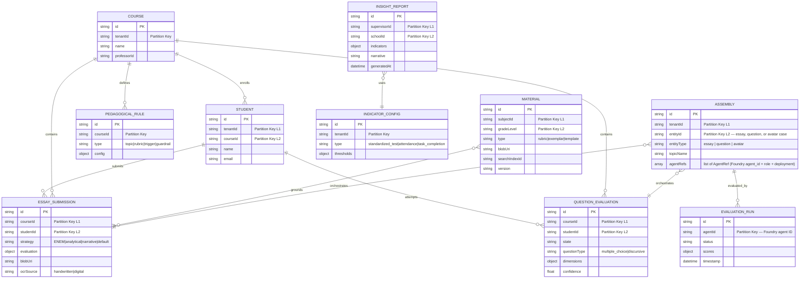

---

## 7. Wave 1 Frontend Component Architecture

```mermaid
graph TB
    subgraph NextJS["Next.js 15 App Router"]
        LAYOUT["layout.tsx\n(DefaultLayout + Providers)"]
        
        subgraph Pages["App Pages"]
            HOME["/ (Dashboard)"]
            ESSAYS_PAGE["/essays"]
            QUESTIONS_PAGE["/questions"]
            AVATAR_PAGE["/avatar"]
            CONFIG_PAGE["/configuration"]
            EVAL_PAGE["/evaluation"]
            SUPERVISION_PAGE["/supervision (new)"]
            CONTENT_PAGE["/content (new)"]
        end
        
        subgraph Components["Component Library"]
            subgraph Assessment_UI["Assessment"]
                ESSAY_FORM["EssaySubmission\n(OCR upload + digital)"]
                QUESTION_FORM["StudentQuestionAnswer\n(MC + discursive)"]
            end
            
            subgraph Interaction_UI["Interaction"]
                AVATAR_COMP["Avatar (WebRTC)"]
                CHAT_COMP["ChatCard\n(guided tutoring)"]
            end
            
            subgraph Config_UI["Configuration"]
                LISTS["Lists (Essays, Questions)"]
                FORMS["Forms (Courses, Students)"]
                RULES["PedagogicalRules\n(topics, rubrics, guardrails)"]
            end
            
            subgraph Eval_UI["Evaluation"]
                EVAL_DASHBOARD["EvalDashboard"]
                EVAL_RUN["EvalRunViewer"]
                AVATAR_PARAMS["AvatarParameterSelector"]
            end

            subgraph Supervision_UI["Supervision (new)"]
                BRIEFING["BriefingReport\n(Strava-like narrative)"]
                SCHOOL_SELECT["SchoolSelector\n(scoped to supervisor)"]
                INDICATOR_TRENDS["IndicatorTrends\n(sparkline cards)"]
            end

            subgraph Content_UI["Content (new)"]
                MATERIAL_UPLOAD["MaterialUpload"]
                MATERIAL_LIST["MaterialLibrary"]
            end
        end
        
        subgraph State["State Management"]
            ZUSTAND["Zustand stores"]
            CONTEXTS["React contexts"]
        end
        
        subgraph API_Layer["API Layer"]
            API_CLIENTS["Typed axios clients\n(per service, 10 total)"]
        end
    end
    
    LAYOUT --> Pages
    Pages --> Components
    Components --> State
    Components --> API_Layer
```

---

## 8. Agentic Microservice Implementation Flows

This section documents the **as-implemented** internal architecture of each microservice, showing how design patterns, agent orchestration, and Azure service integrations are wired in code.

> **Foundry-First Architecture (ADR-011):** All agent definitions live in Azure AI Foundry as persistent agents with stable `agent_id` values. Services load agents from Foundry via `AzureAIAgentClient` and orchestrate them with Agent Framework rc3 patterns (`SequentialBuilder`, `ConcurrentBuilder`, `HandoffBuilder`). Cosmos DB stores **assemblies** — lightweight references that map Foundry agents to business entities (essays, questions, avatars). No backward compatibility shims exist; all services target Agent Framework `>=1.0.0rc3` with `azure-ai-projects>=2.0.0`.

### 8.1 Essays Service — Strategy + Orchestrator Pattern

The essays service uses a **Strategy pattern** to select the evaluation approach and an **Orchestrator** to compose OCR, RAG, and Foundry agent execution.

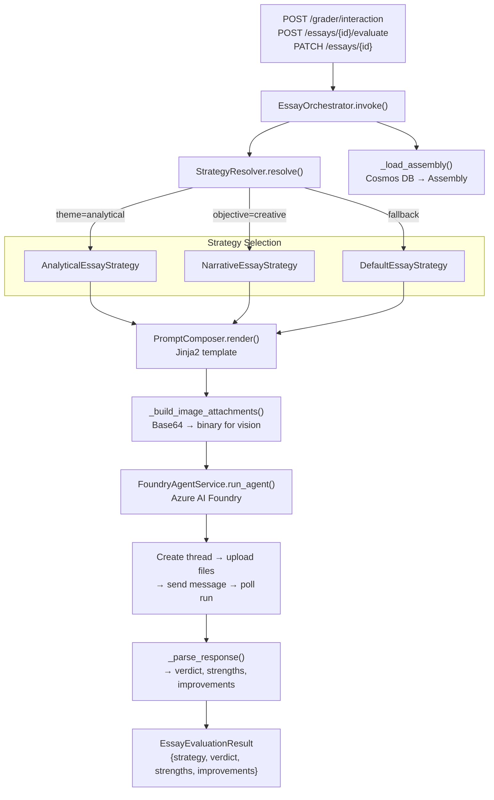

**Key integration points:**

- **Cosmos DB**: Assemblies (Foundry agent references), essays, resources
- **Blob Storage**: Original essay documents and resource files
- **Azure AI Foundry**: Agent execution via `AzureAIAgentClient` + `ChatAgent` (threads, messages, file uploads)
- **AI Document Intelligence**: OCR for handwritten essay scanning (required — no fallback)
- **AI Search** (target): RAG grounding for rubrics and exemplars
- **Agent Framework rc3**: `SequentialBuilder` for OCR → strategy → grading → synthesis pipeline
- **Partial updates**: `PATCH /essays/{id}` via `EssayPatch` model; `PUT` filters `None` values to prevent destructive overwrites of linked fields like `assembly_id`

---

### 8.2 Questions Service — State Machine Pattern

The questions service implements a **State Machine** for evaluation lifecycle with parallel agent dimension grading.

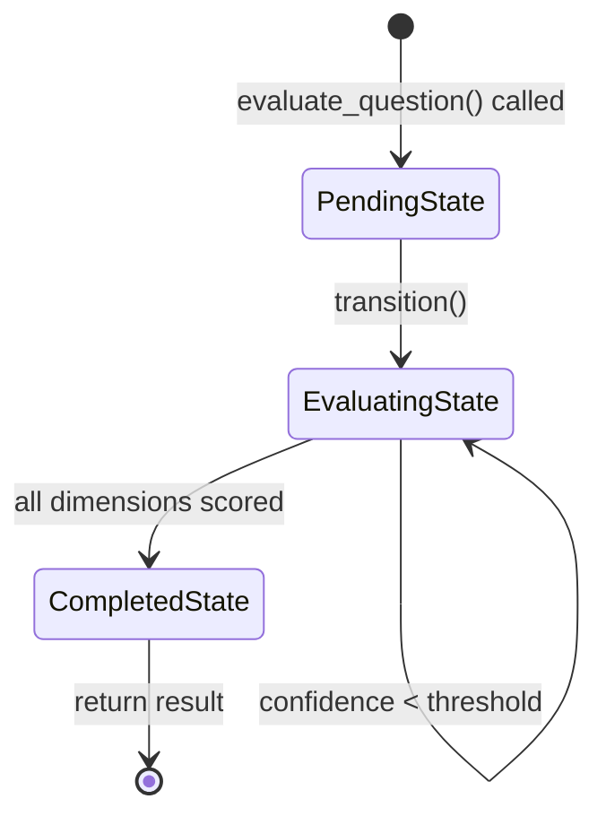

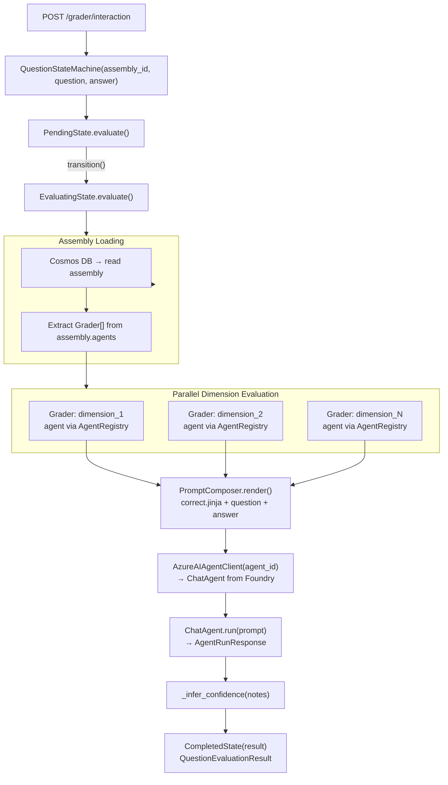

**Key integration points:**

- **Cosmos DB**: Assemblies (Foundry agent references), questions, answers, graders
- **Azure AI Foundry**: Agent execution via Agent Framework rc3 (`ChatAgent` + `ConcurrentBuilder` for parallel dimensions)
- **Jinja2**: Prompt rendering with question/answer context per grading dimension

---

### 8.3 Avatar Service — Agent + Speech Pipeline

The avatar service orchestrates **conversational AI tutoring** backed by case profiles loaded from Cosmos DB.

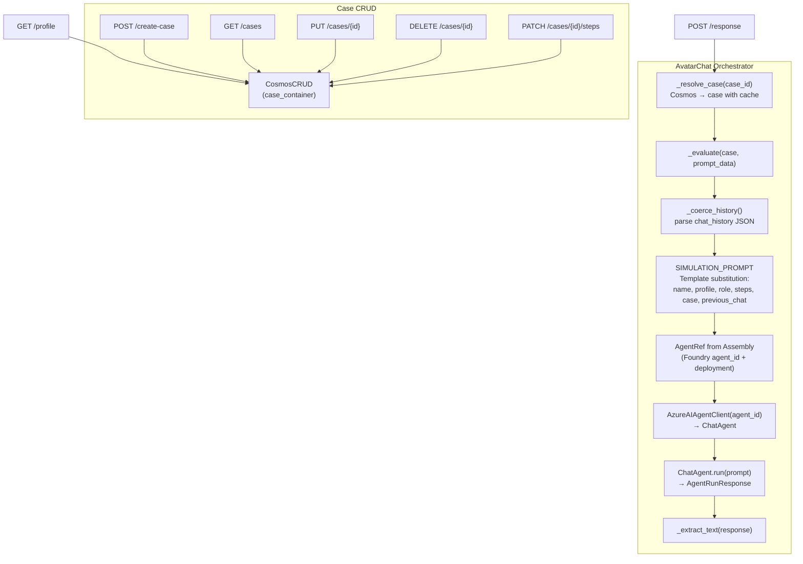

**Key integration points:**

- **Cosmos DB**: Case profiles (steps, patient data) for avatar persona
- **Azure AI Foundry** (via Agent Framework rc3): Conversation generation with `ChatAgent`
- **Azure Speech** (target): TTS/STT + WebRTC for voice interaction

---

### 8.4 Upskilling Service — Visitor Pattern with Async Iteration

The upskilling service evaluates professor lesson plans paragraph-by-paragraph using multiple **Visitor agents** and an **async iterator**.

```mermaid
flowchart TD
    API["POST /plans/{plan_id}/evaluate"]
    ORCH["PlanEvaluationOrchestrator.evaluate(request)"]
    CTX["PlanContext\n{timeframe, topic, class_id, performance_history}"]
    ITER["PlanEvaluationIterable\n→ PlanEvaluationIterator"]

    subgraph Paragraph["For Each Paragraph"]
        ELEMENT["PlanParagraphElement(index, paragraph, context)"]
        
        subgraph Visitors["Visitor Agents (sequential per paragraph)"]
            PERF["PerformanceInsightVisitor\nagent: performance-analyst\ntemplate: performance.jinja"]
            CONTENT["ContentComplexityVisitor\nagent: content-curator\ntemplate: content_complexity.jinja"]
            GUIDANCE["GuidanceCoachVisitor\nagent: guidance-coach\ntemplate: guidance.jinja"]
        end

        ACCEPT["element.accept(visitor)\n→ AgentFeedback"]
    end

    PROMPT["PromptComposer.render()\nJinja2 template with paragraph + context"]
    AGENT_RUN["ChatAgent.run(prompt) via AzureAIAgentClient\nFoundry agent loaded by agent_id"]
    PARSE["_parse_feedback(text)\n→ verdict, strengths, improvements"]
    EVAL["ParagraphEvaluation\n{paragraph_index, title, feedback[]}"]
    RESULT["PlanEvaluationResponse\n{timeframe, topic, evaluations[]}"]

    API --> ORCH --> CTX --> ITER
    ITER -->|"async for"| Paragraph
    ELEMENT --> ACCEPT
    ACCEPT --> PERF
    ACCEPT --> CONTENT
    ACCEPT --> GUIDANCE
    PERF --> PROMPT --> AGENT_RUN --> PARSE --> EVAL
    CONTENT --> PROMPT
    GUIDANCE --> PROMPT
    EVAL --> RESULT
```

**Key integration points:**

- **Azure AI Foundry**: Three specialized agents per paragraph evaluation (loaded by Foundry agent_id)
- **Jinja2**: Template-driven prompt composition with performance history context
- **tutor_lib**: Shared `ChatAgent` wrappers, `AzureAIAgentClient`, `Assembly` models

---

### 8.5 Configuration Service — Repository + Bulk Sync

The configuration service manages roster data with a **repository pattern** and provides bulk LMS synchronization.

```mermaid
flowchart TD
    subgraph CRUD["Entity CRUD Operations"]
        direction TB
        STUDENTS["POST/GET /students"]
        PROFS["POST/GET /professors"]
        COURSES["POST/GET /courses"]
        CLASSES["POST/GET /classes"]
        GROUPS["POST/GET /groups"]
        ASSIGN["POST /groups/{id}/assign-cases"]
    end

    subgraph BulkSync["LMS Bulk Sync"]
        BULK_API["POST /lms/bulk-sync"]
        PAYLOAD["BulkRosterSyncRequest\n{students[], professors[], courses[], classes[], groups[]}"]
        BULK_FN["_bulk_create(container, items)\nSequential CosmosCRUD.create_item()"]
        COUNTS["Response: counts per entity type"]
    end

    AUTH["require_professor()\nX-User-Id header check"]
    CRUD_FN["_crud(container)\nCosmosCRUD (lru_cached)"]
    COSMOS["Azure Cosmos DB\n(per-entity containers)"]

    STUDENTS --> AUTH --> CRUD_FN --> COSMOS
    PROFS --> AUTH
    COURSES --> AUTH
    CLASSES --> AUTH
    GROUPS --> AUTH
    ASSIGN --> AUTH

    BULK_API --> AUTH --> PAYLOAD --> BULK_FN --> COSMOS
    BULK_FN --> COUNTS
```

---

### 8.6 LMS Gateway — Adapter + Background Job Queue

The LMS gateway implements the **Adapter pattern** for external LMS providers and a **background job queue** for async sync operations.

```mermaid
flowchart TD
    subgraph Endpoints
        SYNC["POST /lms/sync\n(immediate)"]
        SCHEDULE["POST /lms/sync/schedule\n(background)"]
        STATUS["GET /lms/sync/jobs/{job_id}"]
    end

    subgraph Adapters["Adapter Pattern"]
        BASE["BaseLMSAdapter (ABC)\nget_courses, get_students,\nget_assignments, push_scores"]
        MOODLE["MoodleAdapter\nprovider=moodle\nhttpx → /api/v1/*"]
        CANVAS["CanvasAdapter\nprovider=canvas\nhttpx → /api/v1/*"]
    end

    subgraph Jobs["Background Job Queue"]
        QUEUE["SyncJobQueue"]
        CREATE_JOB["create_job(adapter)\n→ SyncJob(status=queued)"]
        BG_TASK["run_in_background(job, adapter)\nasyncio.create_task"]
        RUN_JOB["_run_job()\nqueued → running → completed/failed"]
        EXECUTE["_execute_sync(adapter)\n→ SyncResult"]
    end

    subgraph Store["Job Persistence"]
        STORE_ABC["SyncJobStore (ABC)"]
        MEM_STORE["InMemorySyncJobStore"]
        COSMOS_STORE["CosmosSyncJobStore\ndocType=lms_sync_job"]
    end

    SETTINGS["LMSGatewaySettings\nMoodle/Canvas URL + token\n(env vars)"]

    SYNC --> MOODLE
    SYNC --> CANVAS
    SCHEDULE --> CREATE_JOB --> BG_TASK --> RUN_JOB --> EXECUTE
    EXECUTE --> MOODLE
    EXECUTE --> CANVAS
    STATUS --> QUEUE

    BASE --> MOODLE
    BASE --> CANVAS
    QUEUE --> STORE_ABC
    STORE_ABC --> MEM_STORE
    STORE_ABC --> COSMOS_STORE

    SETTINGS --> MOODLE
    SETTINGS --> CANVAS
```

**Key integration points:**

- **External LMS APIs**: Moodle and Canvas via HTTP (`httpx`)
- **Cosmos DB**: Job persistence with `CosmosSyncJobStore` (docType-filtered)
- **Environment**: `LMS_JOB_STORE=memory|cosmos` for store selection

---

### 8.7 Evaluation Service — Dataset + Run Orchestration

The evaluation service manages **golden datasets** and **evaluation runs** for agent quality measurement.

```mermaid
flowchart TD
    subgraph DatasetOps["Dataset Management"]
        CREATE_DS["POST /datasets\nDatasetRequest → DatasetRecord"]
        LIST_DS["GET /datasets\n→ DatasetRecord[]"]
    end

    subgraph RunOps["Evaluation Run Lifecycle"]
        START_RUN["POST /evaluation/run\nRunRequest(agent_id, dataset_id)"]
        GET_RUN["GET /evaluation/run/{run_id}\n→ RunRecord"]
        VALIDATE["Verify dataset exists\n404 if not found"]
        CREATE_RUN["RunRecord(\nrun_id, agent_id, dataset_id,\nstatus=queued, total_cases)"]
    end

    subgraph Repository["Repository Abstraction"]
        REPO_ABC["EvaluationRepository (ABC)"]
        MEM_REPO["InMemoryEvaluationRepository\ndict-based"]
        COSMOS_REPO["CosmosEvaluationRepository\ndocType=dataset|run"]
    end

    ENV["EVALUATION_REPOSITORY=memory|cosmos"]

    CREATE_DS --> REPO_ABC
    LIST_DS --> REPO_ABC
    START_RUN --> VALIDATE --> CREATE_RUN --> REPO_ABC
    GET_RUN --> REPO_ABC

    REPO_ABC --> MEM_REPO
    REPO_ABC --> COSMOS_REPO
    ENV --> REPO_ABC
```

**Integration** (evaluation execution pipeline):

- **Azure AI Foundry**: Execute target agent against golden dataset cases via `AzureAIAgentClient`
- **Foundry Evaluators**: Score with groundedness, relevance, coherence, fluency
- **Cosmos DB**: Persist run results and quality trend data
- **Agent Framework rc3**: `SequentialBuilder` for agent run → evaluator run → metric collection

---

### 8.8 Chat Service — Guided Tutoring (Scaffold)

The chat service is scaffolded for **guided writing support** that provides hints without direct answers.

```mermaid
flowchart TD
    API["POST /guide"]
    REQ["GuidanceRequest\n{student_id, course_id, prompt}"]
    HEALTH["GET /health"]

    subgraph Target["Target Architecture"]
        RULES["config-svc → Load pedagogical rules\n(guardrails, triggers, limits)"]
        RAG["AI Search → Query rubrics + exemplars"]
        LLM["Azure OpenAI → Generate guidance\n(hint, not answer)"]
        GUARD["Apply guardrails\n(no direct answers, respect limits)"]
        PERSIST["Cosmos DB → Persist conversation turn"]
    end

    API --> REQ
    REQ -->|"current: stub response"| RESPONSE["Static guidance string"]
    REQ -.->|"target: full pipeline"| RULES --> RAG --> LLM --> GUARD --> PERSIST
    HEALTH --> OK["status: ok"]
```

---

### 8.9 Platform Integration Overview

This diagram shows how all **implemented** services connect through the shared infrastructure.

```mermaid
graph TB
    subgraph Frontend["Next.js SPA"]
        UI["Tutor UI\n(Static Web App)"]
    end

    subgraph Platform["Platform Domain"]
        CONFIG["config-svc\nFastAPI :8081\nRepository Pattern"]
        LMS_GW["lms-gateway\nFastAPI :8087\nAdapter + Job Queue"]
    end

    subgraph Assessment["Assessment Domain"]
        ESSAYS["essays-svc\nFastAPI :8083\nStrategy + Orchestrator"]
        QUESTIONS["questions-svc\nFastAPI :8082\nState Machine"]
    end

    subgraph Interaction["Interaction Domain"]
        AVATAR["avatar-svc\nFastAPI :8084\nAgent + Speech"]
        CHAT["chat-svc\nFastAPI :8088\nGuided Tutoring"]
    end

    subgraph Analytics["Analytics Domain"]
        UPSKILLING["upskilling-svc\nFastAPI :8085\nVisitor Pattern"]
        EVALUATION["evaluation-svc\nFastAPI :8086\nDataset + Run Pipeline"]
    end

    subgraph SharedLib["tutor-lib"]
        LIB_CONFIG["config/\nSettings, AppFactory"]
        LIB_COSMOS["cosmos/\nCosmosCRUD"]
        LIB_AGENTS["agents/\nChatAgent, AzureAIAgentClient\nSequentialBuilder, ConcurrentBuilder"]
    end

    subgraph Azure["Azure Services"]
        COSMOS[("Cosmos DB")]
        FOUNDRY["AI Foundry\n(Agents)"]
        OPENAI["Azure OpenAI"]
        SPEECH["Azure Speech"]
        BLOB["Blob Storage"]
    end

    subgraph External["External"]
        EXT_LMS["Moodle / Canvas\nLMS APIs"]
    end

    UI --> CONFIG & ESSAYS & QUESTIONS & AVATAR & CHAT & UPSKILLING & EVALUATION

    CONFIG --> LIB_CONFIG & LIB_COSMOS --> COSMOS
    LMS_GW --> LIB_CONFIG
    LMS_GW --> EXT_LMS
    LMS_GW --> COSMOS

    ESSAYS --> LIB_COSMOS & LIB_AGENTS
    ESSAYS --> COSMOS & FOUNDRY & BLOB

    QUESTIONS --> LIB_COSMOS & LIB_AGENTS
    QUESTIONS --> COSMOS & FOUNDRY

    AVATAR --> LIB_COSMOS
    AVATAR --> COSMOS & OPENAI & SPEECH

    UPSKILLING --> LIB_AGENTS
    UPSKILLING --> FOUNDRY

    EVALUATION --> LIB_COSMOS
    EVALUATION --> COSMOS
```

---

### 8.10 Design Pattern Summary

| Service | Pattern | Agent Framework (rc3) | Orchestration | Persistence | External AI |
| ------- | ------- | --------------------- | ------------- | ----------- | ----------- |
| **essays-svc** | Strategy + Orchestrator | `ChatAgent` via `AzureAIAgentClient` | `SequentialBuilder` (OCR → strategy → grading → synthesis) | Cosmos DB (assemblies) + Blob | AI Foundry, Doc Intel, AI Search |
| **questions-svc** | State Machine | `ChatAgent` via `AzureAIAgentClient` | `ConcurrentBuilder` (parallel dimension grading) | Cosmos DB (assemblies) | AI Foundry |
| **avatar-svc** | Agent + Speech | `ChatAgent` via `AzureAIAgentClient` | Single agent with conversation memory | Cosmos DB (cases) | AI Foundry, Speech |
| **upskilling-svc** | Visitor + Async Iterator | `ChatAgent` via `AzureAIAgentClient` | `ConcurrentBuilder` (visitors) → `SequentialBuilder` (aggregation) | Cosmos DB | AI Foundry |
| **config-svc** | Repository + Bulk Sync | N/A (non-agentic) | N/A | Cosmos DB | None |
| **lms-gateway** | Adapter + Job Queue | N/A (non-agentic) | N/A | Cosmos DB | External LMS APIs |
| **evaluation-svc** | Dataset + Run Pipeline | Foundry Evaluators | `SequentialBuilder` (agent run → evaluator → metrics) | Cosmos DB | AI Foundry |
| **chat-svc** | Guided Tutoring (scaffold) | `ChatAgent` via `AzureAIAgentClient` | Single agent with guardrails | Cosmos DB | AI Foundry, AI Search |
