# Architecture

> Target architecture for **The Tutor** — a multi-agent LMS-enhancer platform that integrates with existing educational ecosystems. This document describes every major flow using Mermaid diagrams and explains the system topology after modernization.

---

## 1. High-Level System Context

The Tutor operates within an existing educational ecosystem as an **AI enhancement layer** for the host LMS. It serves three primary personas: **students** (AI-assisted learning), **teachers** (AI-corrected assessments + pedagogical content), and **supervisors** (data-driven school supervision with narrative insight reports).

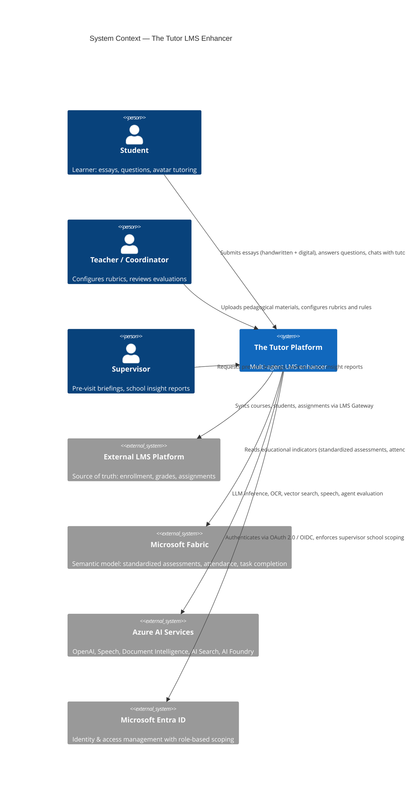

---

## 2. Container Diagram (Target State)

After modernization, the system is decomposed into **five business domains** with a **shared library** and centralized infrastructure. Two new domains (Supervision, Content) address the core business agendas directly.

```mermaid
C4Container
    title Container Diagram — The Tutor Platform

    Person(student, "Student")
    Person(teacher, "Teacher")
    Person(supervisor, "Supervisor")

    Container_Boundary(frontend_boundary, "Frontend") {
        Container(ui, "Tutor UI", "Next.js 15 / React 19", "SPA hosted on Azure Static Web Apps")
    }

    Container_Boundary(gateway, "API Gateway") {
        Container(apim, "API Management", "Azure APIM", "Rate limiting, auth, routing")
    }

    Container_Boundary(platform_domain, "Platform Domain (Non-Agentic)") {
        Container(config_svc, "Configuration Service", "FastAPI / ACA", "CRUD: students, courses, pedagogical rules")
        Container(lms_gateway, "LMS Gateway", "FastAPI / ACA", "Adapter for external LMS sync")
        Container(content_svc, "Content Service", "FastAPI / ACA", "Pedagogical material ingestion & RAG index")
    }

    Container_Boundary(assessment_domain, "Assessment Domain (Agentic)") {
        Container(essays_svc, "Essays Service", "FastAPI / ACA", "Strategy-based essay evaluation + OCR + ENEM")
        Container(questions_svc, "Questions Service", "FastAPI / ACA", "State-machine question grading + discursive")
    }

    Container_Boundary(interaction_domain, "Interaction Domain (Agentic)") {
        Container(avatar_svc, "Avatar Service", "FastAPI / ACA", "Speech-driven avatar tutoring")
        Container(chat_svc, "Chat Service", "FastAPI / ACA", "Guided text tutoring during writing")
    }

    Container_Boundary(analytics_domain, "Analytics Domain (Agentic)") {
        Container(upskilling_svc, "Upskilling Service", "FastAPI / ACA", "Performance & guidance analysis")
        Container(evaluation_svc, "Evaluation Service", "FastAPI / ACA", "Agent quality evaluation via Foundry")
    }

    Container_Boundary(supervision_domain, "Supervision Domain (Agentic)") {
        Container(insights_svc, "Insights Service", "FastAPI / ACA", "Supervisor briefings from Fabric indicators")
    }

    Container_Boundary(data, "Data Layer") {
        ContainerDb(cosmos, "Azure Cosmos DB", "NoSQL", "5 databases with HPK")
        ContainerDb(blob, "Azure Blob Storage", "Object Store", "Essays, pedagogical materials")
    }

    Container_Boundary(ai, "AI Services (Cloud Only)") {
        Container(openai, "Azure OpenAI", "GPT-4o", "LLM inference")
        Container(speech, "Azure Speech", "TTS/STT", "Avatar voice")
        Container(foundry, "Azure AI Foundry", "Agents", "Agent orchestration & evaluation")
        Container(doc_intel, "AI Document Intelligence", "OCR", "Handwritten essay scanning")
        Container(ai_search, "Azure AI Search", "Vector Index", "RAG over pedagogical materials")
    }

    Container_Boundary(external, "External Systems") {
        Container(fabric, "Microsoft Fabric", "Semantic Model", "Standardized assessments, attendance, task completion")
    }

    Rel(student, ui, "HTTPS")
    Rel(teacher, ui, "HTTPS")
    Rel(supervisor, ui, "HTTPS")
    Rel(ui, apim, "REST / WebSocket")
    Rel(apim, essays_svc, "")
    Rel(apim, questions_svc, "")
    Rel(apim, avatar_svc, "")
    Rel(apim, chat_svc, "")
    Rel(apim, upskilling_svc, "")
    Rel(apim, evaluation_svc, "")
    Rel(apim, config_svc, "")
    Rel(apim, lms_gateway, "")
    Rel(apim, content_svc, "")
    Rel(apim, insights_svc, "")

    Rel(essays_svc, cosmos, "")
    Rel(essays_svc, blob, "")
    Rel(essays_svc, foundry, "")
    Rel(essays_svc, doc_intel, "OCR handwritten essays")
    Rel(essays_svc, ai_search, "RAG: rubrics & exemplars")
    Rel(questions_svc, cosmos, "")
    Rel(questions_svc, foundry, "")
    Rel(questions_svc, ai_search, "RAG: pedagogical context")
    Rel(avatar_svc, cosmos, "")
    Rel(avatar_svc, openai, "")
    Rel(avatar_svc, speech, "")
    Rel(chat_svc, cosmos, "")
    Rel(chat_svc, openai, "")
    Rel(chat_svc, ai_search, "RAG: guided tutoring context")
    Rel(upskilling_svc, cosmos, "")
    Rel(evaluation_svc, foundry, "")
    Rel(insights_svc, fabric, "Read educational indicators")
    Rel(insights_svc, openai, "Narrative synthesis")
    Rel(insights_svc, cosmos, "")
    Rel(content_svc, blob, "Store materials")
    Rel(content_svc, doc_intel, "Extract text from uploads")
    Rel(content_svc, ai_search, "Index for RAG")
    Rel(config_svc, cosmos, "")
    Rel(lms_gateway, cosmos, "")
```

---

## 3. Service Interaction Flows

### 3.1 Essay Evaluation Flow (with OCR + ENEM)

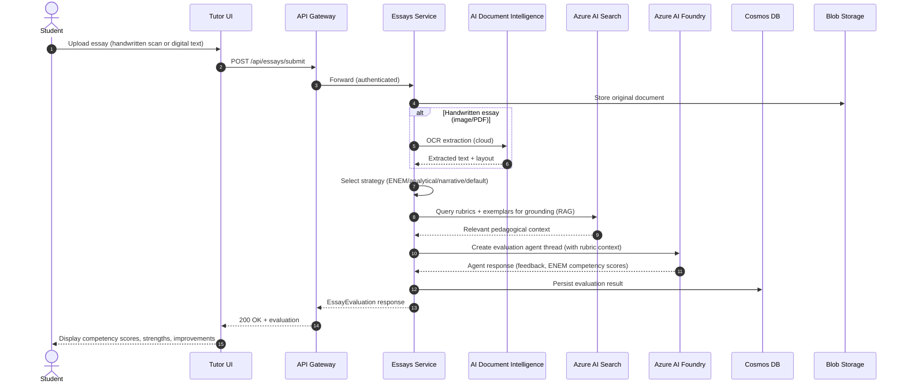

### 3.2 Question Evaluation Flow (State Machine)

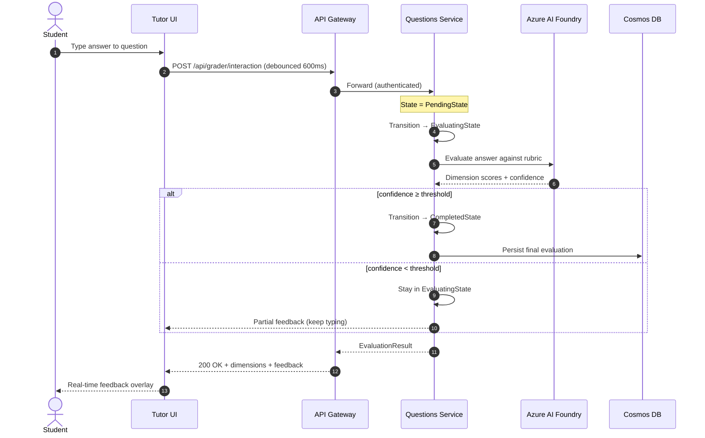

### 3.3 Avatar Interaction Flow

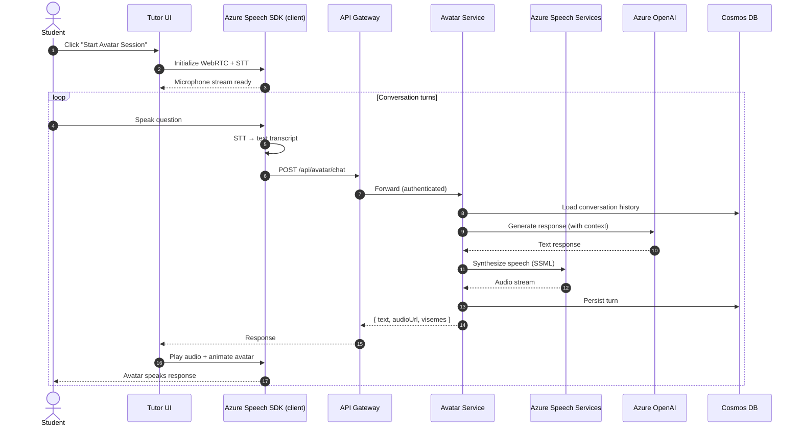

### 3.4 Upskilling Analysis Flow

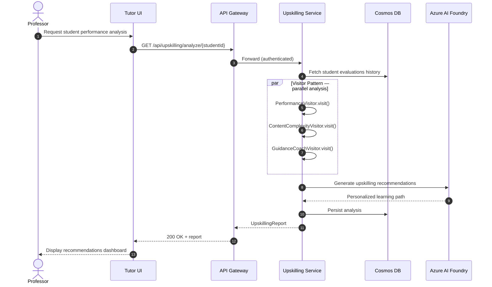

### 3.5 Configuration CRUD Flow

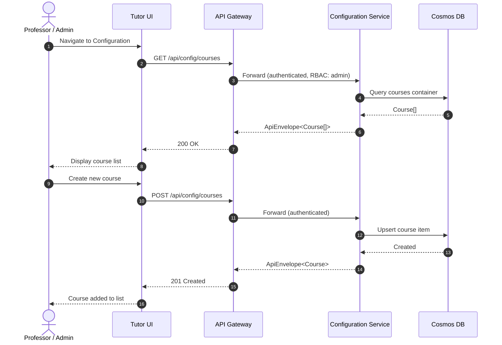

### 3.6 Agent Evaluation Flow (New)

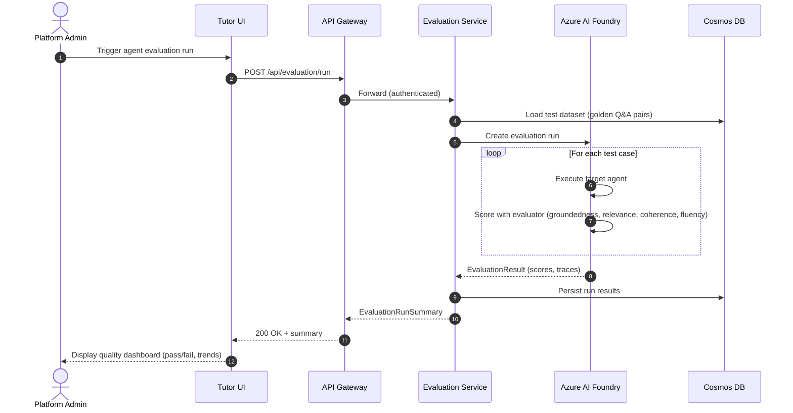

### 3.7 LMS Gateway Sync Flow (New)

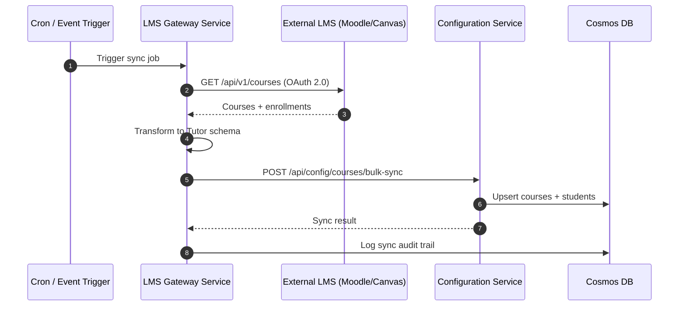

### 3.8 Supervisor Insight Report Flow (New)

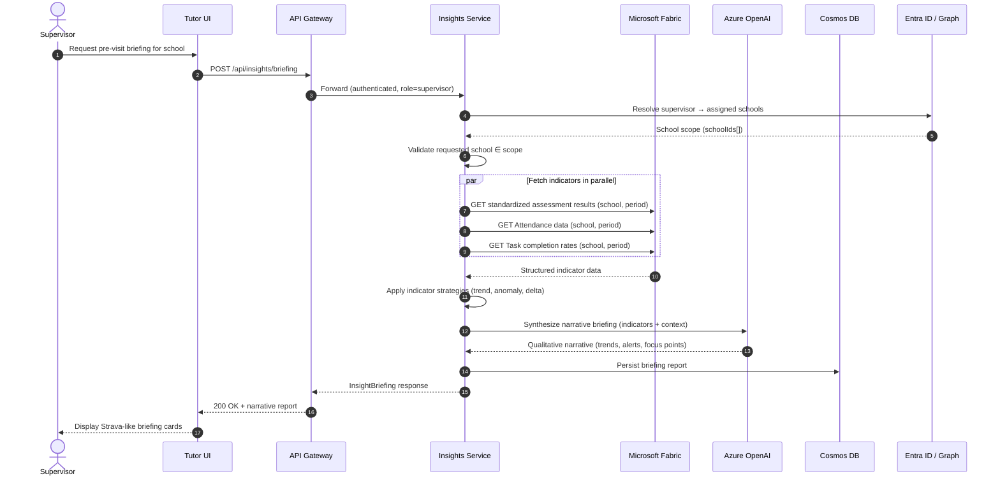

### 3.9 Pedagogical Content Ingestion Flow (New)

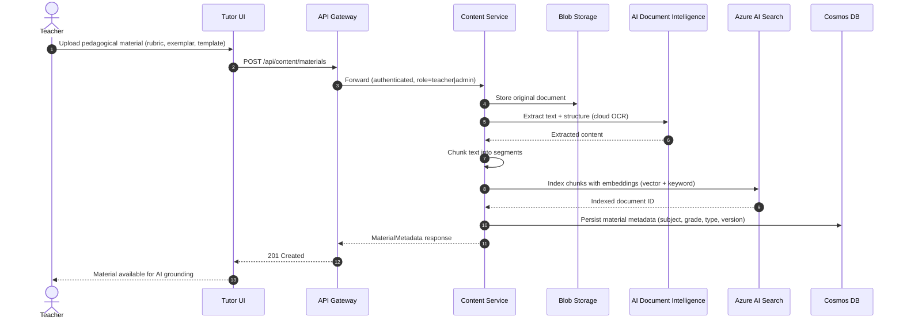

### 3.10 Guided Tutoring Flow (Chat Service)

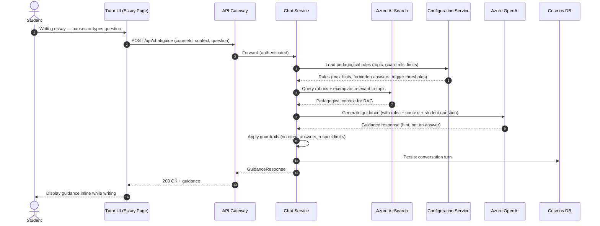

---

## 4. Deployment Topology

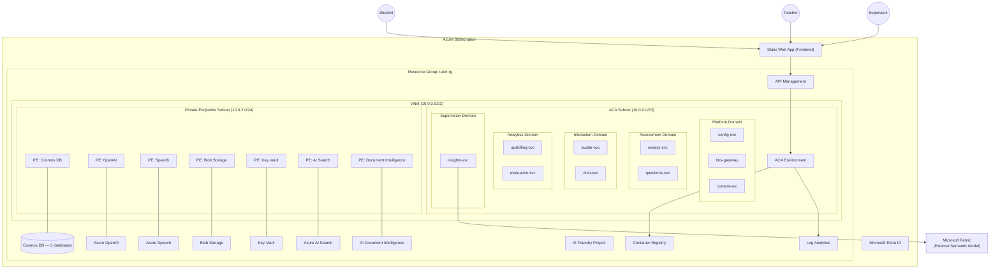

---

## 5. Shared Library Architecture

Following the [holiday-peak-hub](https://github.com/Azure-Samples/holiday-peak-hub) reference, all services consume a shared `lib/` package.

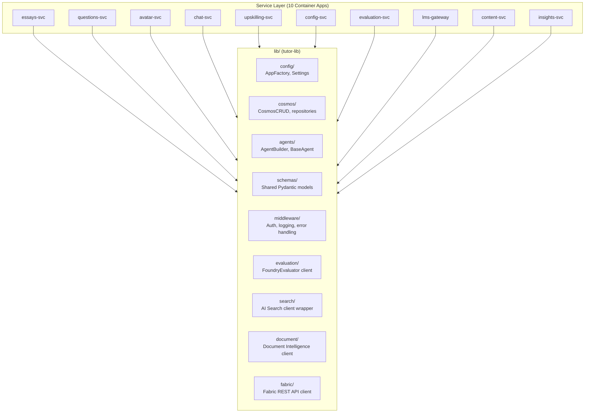

---

## 6. Data Model (Cosmos DB Partitioning)

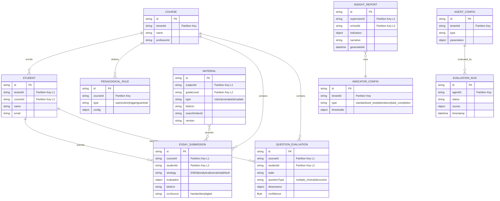

---

## 7. Frontend Component Architecture

```mermaid
graph TB
    subgraph NextJS["Next.js 15 App Router"]
        LAYOUT["layout.tsx\n(DefaultLayout + Providers)"]
        
        subgraph Pages["App Pages"]
            HOME["/ (Dashboard)"]
            ESSAYS_PAGE["/essays"]
            QUESTIONS_PAGE["/questions"]
            AVATAR_PAGE["/avatar"]
            CONFIG_PAGE["/configuration"]
            EVAL_PAGE["/evaluation"]
            SUPERVISION_PAGE["/supervision (new)"]
            CONTENT_PAGE["/content (new)"]
        end
        
        subgraph Components["Component Library"]
            subgraph Assessment_UI["Assessment"]
                ESSAY_FORM["EssaySubmission\n(OCR upload + digital)"]
                QUESTION_FORM["StudentQuestionAnswer\n(MC + discursive)"]
            end
            
            subgraph Interaction_UI["Interaction"]
                AVATAR_COMP["Avatar (WebRTC)"]
                CHAT_COMP["ChatCard\n(guided tutoring)"]
            end
            
            subgraph Config_UI["Configuration"]
                LISTS["Lists (Essays, Questions)"]
                FORMS["Forms (Courses, Students)"]
                RULES["PedagogicalRules\n(topics, rubrics, guardrails)"]
            end
            
            subgraph Eval_UI["Evaluation"]
                EVAL_DASHBOARD["EvalDashboard"]
                EVAL_RUN["EvalRunViewer"]
                AVATAR_PARAMS["AvatarParameterSelector"]
            end

            subgraph Supervision_UI["Supervision (new)"]
                BRIEFING["BriefingReport\n(Strava-like narrative)"]
                SCHOOL_SELECT["SchoolSelector\n(scoped to supervisor)"]
                INDICATOR_TRENDS["IndicatorTrends\n(sparkline cards)"]
            end

            subgraph Content_UI["Content (new)"]
                MATERIAL_UPLOAD["MaterialUpload"]
                MATERIAL_LIST["MaterialLibrary"]
            end
        end
        
        subgraph State["State Management"]
            ZUSTAND["Zustand stores"]
            CONTEXTS["React contexts"]
        end
        
        subgraph API_Layer["API Layer"]
            API_CLIENTS["Typed axios clients\n(per service, 10 total)"]
        end
    end
    
    LAYOUT --> Pages
    Pages --> Components
    Components --> State
    Components --> API_Layer
```

---

## 8. Agentic Microservice Implementation Flows

This section documents the **as-implemented** internal architecture of each microservice, showing how design patterns, agent orchestration, and Azure service integrations are wired in code.

### 8.1 Essays Service — Strategy + Orchestrator Pattern

The essays service uses a **Strategy pattern** to select the evaluation approach and an **Orchestrator** to compose OCR, RAG, and Foundry agent execution.

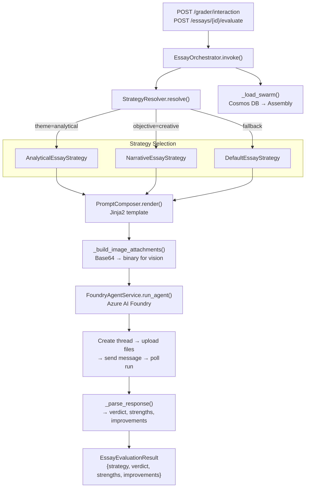

**Key integration points:**

- **Cosmos DB**: Assemblies (agent configurations), essays, resources
- **Blob Storage**: Original essay documents and resource files
- **Azure AI Foundry**: Agent execution via `AgentsClient` (threads, messages, file uploads)
- **AI Document Intelligence** (target): OCR for handwritten essay scanning
- **AI Search** (target): RAG grounding for rubrics and exemplars

---

### 8.2 Questions Service — State Machine Pattern

The questions service implements a **State Machine** for evaluation lifecycle with parallel agent dimension grading.

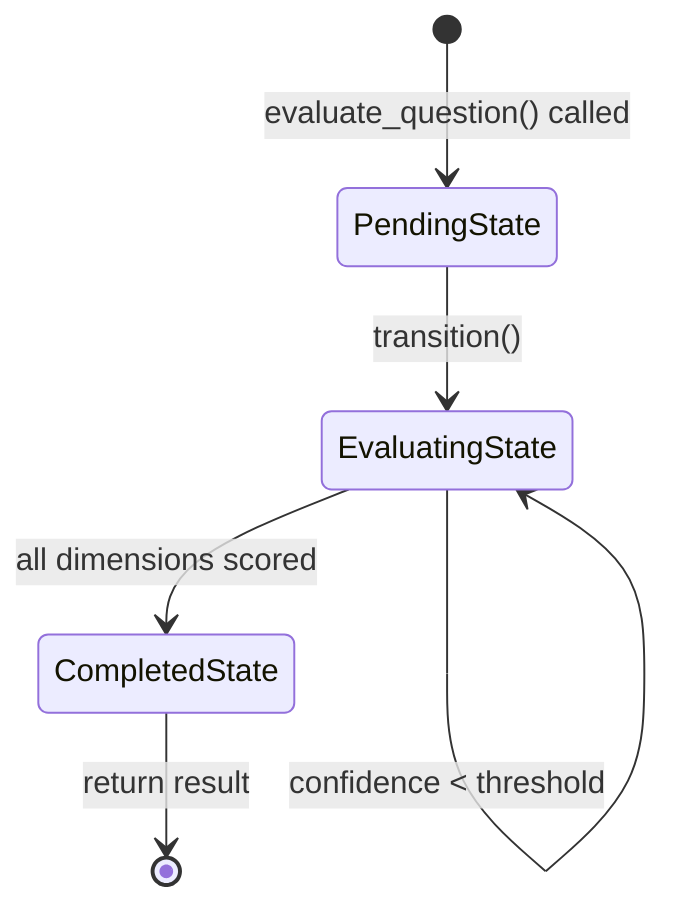

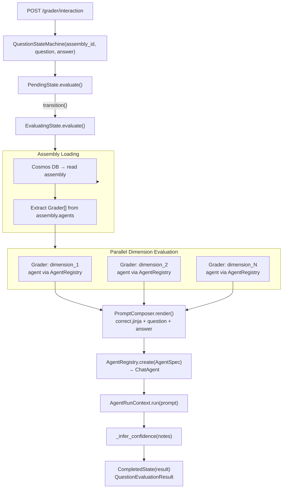

**Key integration points:**

- **Cosmos DB**: Assemblies, questions, answers, graders
- **Azure AI Foundry**: Agent execution via Microsoft Agent Framework (`ChatAgent`)
- **Jinja2**: Prompt rendering with question/answer context per grading dimension

---

### 8.3 Avatar Service — Agent + Speech Pipeline

The avatar service orchestrates **conversational AI tutoring** backed by case profiles loaded from Cosmos DB.

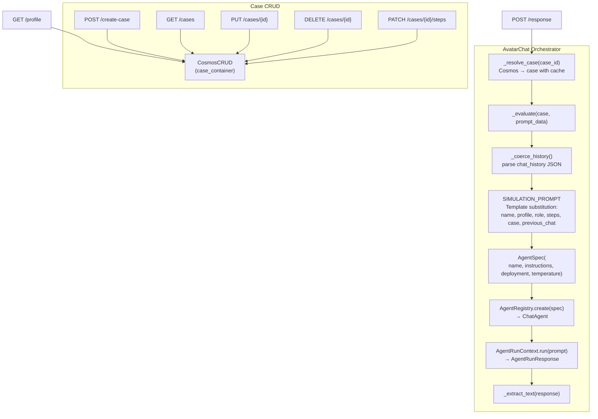

**Key integration points:**

- **Cosmos DB**: Case profiles (steps, patient data) for avatar persona
- **Azure OpenAI** (via Agent Framework): Conversation generation
- **Azure Speech** (target): TTS/STT + WebRTC for voice interaction

---

### 8.4 Upskilling Service — Visitor Pattern with Async Iteration

The upskilling service evaluates professor lesson plans paragraph-by-paragraph using multiple **Visitor agents** and an **async iterator**.

```mermaid
flowchart TD
    API["POST /plan/evaluate"]
    ORCH["PlanEvaluationOrchestrator.evaluate(request)"]
    CTX["PlanContext\n{timeframe, topic, class_id, performance_history}"]
    ITER["PlanEvaluationIterable\n→ PlanEvaluationIterator"]

    subgraph Paragraph["For Each Paragraph"]
        ELEMENT["PlanParagraphElement(index, paragraph, context)"]
        
        subgraph Visitors["Visitor Agents (sequential per paragraph)"]
            PERF["PerformanceInsightVisitor\nagent: performance-analyst\ntemplate: performance.jinja"]
            CONTENT["ContentComplexityVisitor\nagent: content-curator\ntemplate: content_complexity.jinja"]
            GUIDANCE["GuidanceCoachVisitor\nagent: guidance-coach\ntemplate: guidance.jinja"]
        end

        ACCEPT["element.accept(visitor)\n→ AgentFeedback"]
    end

    PROMPT["PromptComposer.render()\nJinja2 template with paragraph + context"]
    AGENT_RUN["AgentRunContext.run(prompt)\nvia AgentRegistry → ChatAgent"]
    PARSE["_parse_feedback(text)\n→ verdict, strengths, improvements"]
    EVAL["ParagraphEvaluation\n{paragraph_index, title, feedback[]}"]
    RESULT["PlanEvaluationResponse\n{timeframe, topic, evaluations[]}"]

    API --> ORCH --> CTX --> ITER
    ITER -->|"async for"| Paragraph
    ELEMENT --> ACCEPT
    ACCEPT --> PERF
    ACCEPT --> CONTENT
    ACCEPT --> GUIDANCE
    PERF --> PROMPT --> AGENT_RUN --> PARSE --> EVAL
    CONTENT --> PROMPT
    GUIDANCE --> PROMPT
    EVAL --> RESULT
```

**Key integration points:**

- **Azure AI Foundry**: Three specialized agents per paragraph evaluation
- **Jinja2**: Template-driven prompt composition with performance history context
- **tutor_lib**: Shared `AgentRegistry`, `AgentRunContext`, `AgentSpec`

---

### 8.5 Configuration Service — Repository + Bulk Sync

The configuration service manages roster data with a **repository pattern** and provides bulk LMS synchronization.

```mermaid
flowchart TD
    subgraph CRUD["Entity CRUD Operations"]
        direction TB
        STUDENTS["POST/GET /students"]
        PROFS["POST/GET /professors"]
        COURSES["POST/GET /courses"]
        CLASSES["POST/GET /classes"]
        GROUPS["POST/GET /groups"]
        ASSIGN["POST /groups/{id}/assign-cases"]
    end

    subgraph BulkSync["LMS Bulk Sync"]
        BULK_API["POST /lms/bulk-sync"]
        PAYLOAD["BulkRosterSyncRequest\n{students[], professors[], courses[], classes[], groups[]}"]
        BULK_FN["_bulk_create(container, items)\nSequential CosmosCRUD.create_item()"]
        COUNTS["Response: counts per entity type"]
    end

    AUTH["require_professor()\nX-User-Id header check"]
    CRUD_FN["_crud(container)\nCosmosCRUD (lru_cached)"]
    COSMOS["Azure Cosmos DB\n(per-entity containers)"]

    STUDENTS --> AUTH --> CRUD_FN --> COSMOS
    PROFS --> AUTH
    COURSES --> AUTH
    CLASSES --> AUTH
    GROUPS --> AUTH
    ASSIGN --> AUTH

    BULK_API --> AUTH --> PAYLOAD --> BULK_FN --> COSMOS
    BULK_FN --> COUNTS
```

---

### 8.6 LMS Gateway — Adapter + Background Job Queue

The LMS gateway implements the **Adapter pattern** for external LMS providers and a **background job queue** for async sync operations.

```mermaid
flowchart TD
    subgraph Endpoints
        SYNC["POST /lms/sync\n(immediate)"]
        SCHEDULE["POST /lms/sync/schedule\n(background)"]
        STATUS["GET /lms/sync/jobs/{job_id}"]
    end

    subgraph Adapters["Adapter Pattern"]
        BASE["BaseLMSAdapter (ABC)\nget_courses, get_students,\nget_assignments, push_scores"]
        MOODLE["MoodleAdapter\nprovider=moodle\nhttpx → /api/v1/*"]
        CANVAS["CanvasAdapter\nprovider=canvas\nhttpx → /api/v1/*"]
    end

    subgraph Jobs["Background Job Queue"]
        QUEUE["SyncJobQueue"]
        CREATE_JOB["create_job(adapter)\n→ SyncJob(status=queued)"]
        BG_TASK["run_in_background(job, adapter)\nasyncio.create_task"]
        RUN_JOB["_run_job()\nqueued → running → completed/failed"]
        EXECUTE["_execute_sync(adapter)\n→ SyncResult"]
    end

    subgraph Store["Job Persistence"]
        STORE_ABC["SyncJobStore (ABC)"]
        MEM_STORE["InMemorySyncJobStore"]
        COSMOS_STORE["CosmosSyncJobStore\ndocType=lms_sync_job"]
    end

    SETTINGS["LMSGatewaySettings\nMoodle/Canvas URL + token\n(env vars)"]

    SYNC --> MOODLE
    SYNC --> CANVAS
    SCHEDULE --> CREATE_JOB --> BG_TASK --> RUN_JOB --> EXECUTE
    EXECUTE --> MOODLE
    EXECUTE --> CANVAS
    STATUS --> QUEUE

    BASE --> MOODLE
    BASE --> CANVAS
    QUEUE --> STORE_ABC
    STORE_ABC --> MEM_STORE
    STORE_ABC --> COSMOS_STORE

    SETTINGS --> MOODLE
    SETTINGS --> CANVAS
```

**Key integration points:**

- **External LMS APIs**: Moodle and Canvas via HTTP (`httpx`)
- **Cosmos DB**: Job persistence with `CosmosSyncJobStore` (docType-filtered)
- **Environment**: `LMS_JOB_STORE=memory|cosmos` for store selection

---

### 8.7 Evaluation Service — Dataset + Run Orchestration

The evaluation service manages **golden datasets** and **evaluation runs** for agent quality measurement.

```mermaid
flowchart TD
    subgraph DatasetOps["Dataset Management"]
        CREATE_DS["POST /datasets\nDatasetRequest → DatasetRecord"]
        LIST_DS["GET /datasets\n→ DatasetRecord[]"]
    end

    subgraph RunOps["Evaluation Run Lifecycle"]
        START_RUN["POST /evaluation/run\nRunRequest(agent_id, dataset_id)"]
        GET_RUN["GET /evaluation/run/{run_id}\n→ RunRecord"]
        VALIDATE["Verify dataset exists\n404 if not found"]
        CREATE_RUN["RunRecord(\nrun_id, agent_id, dataset_id,\nstatus=queued, total_cases)"]
    end

    subgraph Repository["Repository Abstraction"]
        REPO_ABC["EvaluationRepository (ABC)"]
        MEM_REPO["InMemoryEvaluationRepository\ndict-based"]
        COSMOS_REPO["CosmosEvaluationRepository\ndocType=dataset|run"]
    end

    ENV["EVALUATION_REPOSITORY=memory|cosmos"]

    CREATE_DS --> REPO_ABC
    LIST_DS --> REPO_ABC
    START_RUN --> VALIDATE --> CREATE_RUN --> REPO_ABC
    GET_RUN --> REPO_ABC

    REPO_ABC --> MEM_REPO
    REPO_ABC --> COSMOS_REPO
    ENV --> REPO_ABC
```

**Target integration** (evaluation execution pipeline):

- **Azure AI Foundry**: Execute target agent against golden dataset cases
- **Foundry Evaluators**: Score with groundedness, relevance, coherence, fluency
- **Cosmos DB**: Persist run results and quality trend data

---

### 8.8 Chat Service — Guided Tutoring (Scaffold)

The chat service is scaffolded for **guided writing support** that provides hints without direct answers.

```mermaid
flowchart TD
    API["POST /chat/guide"]
    REQ["GuidanceRequest\n{student_id, course_id, prompt}"]
    HEALTH["GET /health"]

    subgraph Target["Target Architecture"]
        RULES["config-svc → Load pedagogical rules\n(guardrails, triggers, limits)"]
        RAG["AI Search → Query rubrics + exemplars"]
        LLM["Azure OpenAI → Generate guidance\n(hint, not answer)"]
        GUARD["Apply guardrails\n(no direct answers, respect limits)"]
        PERSIST["Cosmos DB → Persist conversation turn"]
    end

    API --> REQ
    REQ -->|"current: stub response"| RESPONSE["Static guidance string"]
    REQ -.->|"target: full pipeline"| RULES --> RAG --> LLM --> GUARD --> PERSIST
    HEALTH --> OK["status: ok"]
```

---

### 8.9 Platform Integration Overview

This diagram shows how all **implemented** services connect through the shared infrastructure.

```mermaid
graph TB
    subgraph Frontend["Next.js SPA"]
        UI["Tutor UI\n(Static Web App)"]
    end

    subgraph Platform["Platform Domain"]
        CONFIG["config-svc\nFastAPI :8081\nRepository Pattern"]
        LMS_GW["lms-gateway\nFastAPI :8087\nAdapter + Job Queue"]
    end

    subgraph Assessment["Assessment Domain"]
        ESSAYS["essays-svc\nFastAPI :8083\nStrategy + Orchestrator"]
        QUESTIONS["questions-svc\nFastAPI :8082\nState Machine"]
    end

    subgraph Interaction["Interaction Domain"]
        AVATAR["avatar-svc\nFastAPI :8084\nAgent + Speech"]
        CHAT["chat-svc\nFastAPI :8088\nGuided Tutoring"]
    end

    subgraph Analytics["Analytics Domain"]
        UPSKILLING["upskilling-svc\nFastAPI :8085\nVisitor Pattern"]
        EVALUATION["evaluation-svc\nFastAPI :8086\nDataset + Run Pipeline"]
    end

    subgraph SharedLib["tutor-lib"]
        LIB_CONFIG["config/\nSettings, AppFactory"]
        LIB_COSMOS["cosmos/\nCosmosCRUD"]
        LIB_AGENTS["agents/\nAgentRegistry, AgentRunContext"]
    end

    subgraph Azure["Azure Services"]
        COSMOS[("Cosmos DB")]
        FOUNDRY["AI Foundry\n(Agents)"]
        OPENAI["Azure OpenAI"]
        SPEECH["Azure Speech"]
        BLOB["Blob Storage"]
    end

    subgraph External["External"]
        EXT_LMS["Moodle / Canvas\nLMS APIs"]
    end

    UI --> CONFIG & ESSAYS & QUESTIONS & AVATAR & CHAT & UPSKILLING & EVALUATION

    CONFIG --> LIB_CONFIG & LIB_COSMOS --> COSMOS
    LMS_GW --> LIB_CONFIG
    LMS_GW --> EXT_LMS
    LMS_GW --> COSMOS

    ESSAYS --> LIB_COSMOS & LIB_AGENTS
    ESSAYS --> COSMOS & FOUNDRY & BLOB

    QUESTIONS --> LIB_COSMOS & LIB_AGENTS
    QUESTIONS --> COSMOS & FOUNDRY

    AVATAR --> LIB_COSMOS
    AVATAR --> COSMOS & OPENAI & SPEECH

    UPSKILLING --> LIB_AGENTS
    UPSKILLING --> FOUNDRY

    EVALUATION --> LIB_COSMOS
    EVALUATION --> COSMOS
```

---

### 8.10 Design Pattern Summary

| Service | Pattern | Agent Framework | Persistence | External AI |
|---------|---------|-----------------|-------------|-------------|
| **essays-svc** | Strategy + Orchestrator | FoundryAgentService (threads + files) | Cosmos DB + Blob | AI Foundry, Doc Intel, AI Search |
| **questions-svc** | State Machine | AgentRegistry + AgentRunContext | Cosmos DB | AI Foundry |
| **avatar-svc** | Agent + Speech | AgentRegistry + AgentRunContext | Cosmos DB | OpenAI, Speech |
| **upskilling-svc** | Visitor + Async Iterator | AgentRegistry + AgentRunContext | Cosmos DB | AI Foundry |
| **config-svc** | Repository + Bulk Sync | N/A (non-agentic) | Cosmos DB | None |
| **lms-gateway** | Adapter + Job Queue | N/A (non-agentic) | Cosmos DB | External LMS APIs |
| **evaluation-svc** | Dataset + Run Pipeline | Foundry Evaluators (target) | Cosmos DB | AI Foundry (target) |
| **chat-svc** | Guided Tutoring (scaffold) | OpenAI + RAG (target) | Cosmos DB (target) | OpenAI, AI Search |
