# Business Alignment

> Traceability matrix mapping business needs to **The Tutor** platform architecture, ensuring every requirement from the Supervisor Insights and Pedagogical agendas is addressed by a concrete service, ADR, or modernization task.

---

## 1. Business Context

The Tutor operates within a **state education department** ecosystem as an AI-powered **LMS enhancer** for the department's host **LMS platform**. Two primary business agendas drive the platform's evolution:

| Agenda | Focus | Primary Personas |
|--------|-------|-----------------|
| **IA Supervisor** | Data-driven school supervision with narrative insight reports | Supervisors, department leadership |
| **Pedagógica** | AI-corrected essays/discursive questions, virtual tutoring, ENEM alignment | Students, Teachers, Pedagogical coordinators |

---

## 2. Supervisor Insights Agenda — Traceability

### BN-SUP-1: Automated Insight Generation from Educational Indicators

**Business Need**: Translate complex educational indicators (standardized assessment results, student attendance, task completion) from the department's curated semantic model (Fabric / BI platform) into actionable, qualitative insights for supervisors.

| Aspect | Architecture Response |
|--------|----------------------|
| **Service** | `insights-svc` — NEW service in the **Supervision Domain** |
| **Data Source** | Microsoft Fabric semantic model (via REST API / XMLA endpoint) — NOT local data |
| **AI Capability** | Azure OpenAI (gpt-4o) for narrative synthesis from structured indicators |
| **Data Model** | `supervision_db` in Cosmos DB: `insight_reports`, `indicator_configs`, `school_profiles` |
| **ADR** | [ADR-009: Supervisor Insights & Fabric Integration](adr/009-supervisor-fabric-integration.md) |
| **Modernization Task** | Phase 9 — Supervision Domain |

### BN-SUP-2: Pre-Visit Briefing Reports

**Business Need**: Provide supervisors concise, synthetic reports prior to school visits — Strava-like narrative format highlighting risks, improvements, and anomalies, NOT raw dashboards.

| Aspect | Architecture Response |
|--------|----------------------|
| **Service** | `insights-svc` — report generation endpoint (`POST /api/insights/briefing`) |
| **Output Format** | Structured JSON with narrative sections: `trends`, `alerts`, `focus_points`, `improvements` |
| **Refresh Cycle** | Weekly, aligned with Fabric data pipeline schedule |
| **Frontend** | `/supervision` page with narrative cards, trend sparklines, school selector |
| **ADR** | [ADR-009](adr/009-supervisor-fabric-integration.md) |

### BN-SUP-3: Modular Indicator System

**Business Need**: Start with standardized assessments, attendance, and task completion as initial indicators. Expand modularly to additional dimensions without reworking core logic.

| Aspect | Architecture Response |
|--------|----------------------|
| **Design Pattern** | Strategy pattern per indicator — `StandardizedTestIndicator`, `AttendanceIndicator`, `TaskCompletionIndicator` |
| **Configuration** | `indicator_configs` container in Cosmos DB — enables adding new indicators without code changes |
| **Data Contracts** | Each indicator implements `IndicatorStrategy` interface with `fetch()`, `analyze()`, `narrate()` methods |
| **Extensibility** | New indicators = new strategy class + config entry; no changes to `insights-svc` core |

### BN-SUP-4: Validation with Real Supervisors

**Business Need**: Validate insights with real supervisors early via lightweight prototypes using sampled data.

| Aspect | Architecture Response |
|--------|----------------------|
| **Approach** | Feature-flagged pilot in `dev` Azure environment — uses **real** Fabric data subset, scoped to pilot schools |
| **No Simulation** | Pilot runs against cloud Fabric endpoint with read-only service principal access |
| **Feedback Loop** | `feedback` container in `supervision_db` for supervisor satisfaction scores |
| **Modernization Task** | Phase 9 — Supervision Pilot |

### BN-SUP-5: Governance, Data Ownership, Supervisor-Scoped Access

**Business Need**: Supervisors only see data relevant to their assigned schools/regions. Integrated with Microsoft Entra ID.

| Aspect | Architecture Response |
|--------|----------------------|
| **Identity** | Entra ID app role: `supervisor` — added to RBAC matrix |
| **Scope Filtering** | `insights-svc` reads supervisor's school assignments from Entra ID claims or Graph API |
| **Data Isolation** | All queries to Fabric and Cosmos are scoped by `supervisorId` → `schoolIds[]` |
| **RBAC** | Supervisor can read insight reports and school profiles; cannot modify configurations |
| **ADR** | [ADR-009](adr/009-supervisor-fabric-integration.md), [ADR-008](adr/008-security-layers.md) |

---

## 3. Pedagogical Agenda — Traceability

### BN-PED-1: AI-Based Essay and Discursive Question Correction

**Business Need**: Improve quality, scalability, and consistency of essay and discursive-question correction using AI, aligned with ENEM evaluation criteria and official rubrics.

| Aspect | Architecture Response |
|--------|----------------------|
| **Service** | `essays-svc` (existing) + OCR integration via Azure AI Document Intelligence |
| **OCR** | Handwritten essay scanning via `AI Document Intelligence` → text extraction → existing evaluation pipeline |
| **ENEM Rubrics** | New strategy: `ENEMStrategy` in essays service — evaluates across ENEM's 5 competencies |
| **Discursive Questions** | `questions-svc` extended with `DiscursiveState` — handles open-ended answers (not just multiple-choice) |
| **Azure Service** | Azure AI Document Intelligence (cloud) for OCR — no local processing |
| **ADR** | [ADR-010: Pedagogical Content & OCR](adr/010-pedagogical-content-ocr.md) |

### BN-PED-2: Curated Pedagogical Material Ingestion

**Business Need**: Continuously feed AI models with curated pedagogical materials (rubrics, templates, exemplars) produced by subject-matter experts for grounding.

| Aspect | Architecture Response |
|--------|----------------------|
| **Service** | `content-svc` — NEW service in the **Platform Domain** |
| **Storage** | Azure Blob Storage for documents + Azure AI Search for vector index |
| **Ingestion Pipeline** | Upload → Document Intelligence (extraction) → AI Search (chunking + embedding) |
| **RAG Pattern** | Assessment domain services query AI Search for relevant pedagogical context before LLM inference |
| **Governance** | Only `teacher` and `admin` roles can upload materials; versioned with approval workflow |
| **ADR** | [ADR-010](adr/010-pedagogical-content-ocr.md) |

### BN-PED-3: Virtual Tutor/Mentor During Writing

**Business Need**: Provide students with an embedded virtual tutor that supports them conversationally during writing and problem-solving, not just post-submission.

| Aspect | Architecture Response |
|--------|----------------------|
| **Service** | `chat-svc` (planned) — extended with **guided tutoring mode** |
| **Behavior** | Proactive intervention based on configurable triggers (idle time, error patterns, confidence thresholds) |
| **Context** | Chat agent retrieves relevant rubrics and exemplars from `content-svc` via AI Search |
| **Integration** | Embedded in essay submission UI — student writes while tutor provides inline guidance |
| **Avatar** | `avatar-svc` for voice-based tutoring sessions alongside text-based `chat-svc` |
| **Guardrails** | Configurable limits on response frequency, topic scope, and answer-giving prevention |

### BN-PED-4: Modernization from Semantic Kernel to Foundry Agents

**Business Need**: Modernize existing tutor assets from older Semantic Kernel-based implementations to agent-based framework aligned with Azure AI Foundry.

| Aspect | Architecture Response |
|--------|----------------------|
| **Status** | **Already addressed** — Current codebase uses `azure-ai-agents` and `azure-ai-projects` SDKs |
| **Agent Framework** | Azure AI Foundry Agents (not Semantic Kernel) for all agent orchestration |
| **ADR** | [ADR-005: Foundry Agent Evaluation](adr/005-foundry-evaluation.md) |

### BN-PED-5: Configurable Pedagogical Rules

**Business Need**: Educators control topics, questions, rubrics, triggers, conversation limits, and guardrails without code changes.

| Aspect | Architecture Response |
|--------|----------------------|
| **Service** | `config-svc` extended with a **Pedagogical Rules** sub-domain |
| **Data Model** | `pedagogical_rules` container in `platform_db` with schemas for: topic lists, rubric templates, trigger thresholds, guardrail policies, conversation limits |
| **Frontend** | `/configuration/rules` page for educators to manage rules per course/subject |
| **Consumption** | Assessment and Interaction domain services load rules from `config-svc` at request time |
| **Extensibility** | Rules are JSON documents; new rule types can be added as schema extensions |

### BN-PED-6: Controlled Pilot (3rd Year Physics)

**Business Need**: Validate tutor and correction capabilities through a controlled pilot with 3rd-year high school physics students.

| Aspect | Architecture Response |
|--------|----------------------|
| **Mechanism** | Feature flags in `config-svc` — pilot scope defined as `{ grade: "3rd", subject: "physics", schools: [...] }` |
| **Environment** | `dev` Azure environment with the same cloud services as production (scaled down via `dev.tfvars`) |
| **Monitoring** | Pilot-specific evaluation runs via `evaluation-svc`, isolated golden datasets for physics content |
| **No Simulation** | Pilot uses real Azure OpenAI, real Cosmos DB, real AI Search — no emulators or mocks |

---

## 4. Traceability Matrix

```mermaid
graph TB
    subgraph "Supervisor Insights Agenda"
        SUP1["BN-SUP-1\nInsight Generation"]
        SUP2["BN-SUP-2\nPre-Visit Briefings"]
        SUP3["BN-SUP-3\nModular Indicators"]
        SUP4["BN-SUP-4\nSupervisor Validation"]
        SUP5["BN-SUP-5\nGovernance & Scoping"]
    end

    subgraph "Pedagogical Agenda"
        PED1["BN-PED-1\nEssay/Question Correction"]
        PED2["BN-PED-2\nContent Ingestion"]
        PED3["BN-PED-3\nVirtual Tutor"]
        PED4["BN-PED-4\nFoundry Migration"]
        PED5["BN-PED-5\nPedagogical Rules"]
        PED6["BN-PED-6\nControlled Pilot"]
    end

    subgraph "Architecture Components"
        INSIGHTS["insights-svc\n(NEW)"]
        CONTENT["content-svc\n(NEW)"]
        ESSAYS["essays-svc\n(UPDATED)"]
        QUESTIONS["questions-svc\n(UPDATED)"]
        CHAT["chat-svc\n(NEW)"]
        AVATAR["avatar-svc\n(EXISTING)"]
        CONFIG["config-svc\n(UPDATED)"]
        EVAL["evaluation-svc\n(NEW)"]
    end

    subgraph "Azure Services"
        FABRIC["Microsoft Fabric\nSemantic Model"]
        DOC_INTEL["AI Document\nIntelligence"]
        AI_SEARCH["Azure AI Search\nVector Index"]
        OPENAI["Azure OpenAI\ngpt-4o"]
        FOUNDRY["Azure AI Foundry\nEvaluation"]
        ENTRA["Entra ID\nSupervisor Role"]
    end

    SUP1 --> INSIGHTS
    SUP2 --> INSIGHTS
    SUP3 --> INSIGHTS
    SUP4 --> INSIGHTS
    SUP5 --> CONFIG
    SUP5 --> ENTRA

    PED1 --> ESSAYS
    PED1 --> QUESTIONS
    PED1 --> DOC_INTEL
    PED2 --> CONTENT
    PED2 --> AI_SEARCH
    PED3 --> CHAT
    PED3 --> AVATAR
    PED4 --> FOUNDRY
    PED5 --> CONFIG
    PED6 --> EVAL
    PED6 --> CONFIG

    INSIGHTS --> FABRIC
    INSIGHTS --> OPENAI
    CONTENT --> DOC_INTEL
    CONTENT --> AI_SEARCH
    ESSAYS --> AI_SEARCH
    QUESTIONS --> AI_SEARCH
    CHAT --> AI_SEARCH
```

---

## 5. New Azure Services Required

The following cloud services are **additions** to the infrastructure, driven directly by business needs:

| Azure Service | Business Need | Purpose | ADR |
|---------------|---------------|---------|-----|
| **Microsoft Fabric** (external) | BN-SUP-1,2,3 | Read-only access to the department's semantic model for educational indicators | ADR-009 |
| **Azure AI Document Intelligence** | BN-PED-1 | OCR for handwritten essay scanning | ADR-010 |
| **Azure AI Search** | BN-PED-2 | Vector index over pedagogical materials for RAG grounding | ADR-010 |
| **Entra ID** (supervisor role) | BN-SUP-5 | Supervisor-scoped RBAC with school assignments | ADR-008 |

All services are provisioned via Terraform with AVM. No local emulators, no simulated services.

---

## 6. Updated Domain Map

The original 4-domain architecture (Platform, Assessment, Interaction, Analytics) now includes a 5th domain:

| Domain | Services | Business Agenda |
|--------|----------|-----------------|
| **Platform** (Non-Agentic) | config-svc, lms-gateway, content-svc | BN-PED-2, BN-PED-5, BN-SUP-5, BN-PED-6 |
| **Assessment** (Agentic) | essays-svc, questions-svc | BN-PED-1, BN-PED-5 |
| **Interaction** (Agentic) | avatar-svc, chat-svc | BN-PED-3 |
| **Analytics** (Agentic) | upskilling-svc, evaluation-svc | BN-PED-4, BN-PED-6 |
| **Supervision** (Agentic) | insights-svc | BN-SUP-1, BN-SUP-2, BN-SUP-3, BN-SUP-4 |

---

## 7. Cloud-Only Development Policy

> **All environments (dev, test, prod) run on Azure cloud services. No local emulators, mock services, or simulated backends.**

| Principle | Details |
|-----------|---------|
| **Cosmos DB** | Dev environment uses real Azure Cosmos DB (serverless or low-RU provisioned); no Cosmos emulator |
| **Azure OpenAI** | Dev environment uses real Azure OpenAI deployment (lower TPM quota via `dev.tfvars`) |
| **Azure Speech** | Dev environment uses real Azure Speech Services |
| **AI Document Intelligence** | Dev environment uses real cloud endpoint |
| **AI Search** | Dev environment uses real Azure AI Search (Basic tier) |
| **Microsoft Fabric** | Dev environment uses real Fabric workspace with read-only service principal |
| **Container Runtime** | All services deploy to ACA `dev` environment; local runs use `azd deploy` to dev |
| **Why** | Emulators diverge from cloud behavior (feature gaps, consistency models, SDK compatibility). Cloud-only ensures parity across all environments |

---

## Related Documents

| Document | Link |
|----------|------|
| Solution Overview | [solution-overview.md](solution-overview.md) |
| Architecture | [architecture.md](architecture.md) |
| Service Domains | [service-domains.md](service-domains.md) |
| ADR-009: Supervisor Insights | [adr/009-supervisor-fabric-integration.md](adr/009-supervisor-fabric-integration.md) |
| ADR-010: Pedagogical Content & OCR | [adr/010-pedagogical-content-ocr.md](adr/010-pedagogical-content-ocr.md) |
| Modernization Plan | [modernization-plan.md](modernization-plan.md) |
| Security | [security.md](security.md) |
