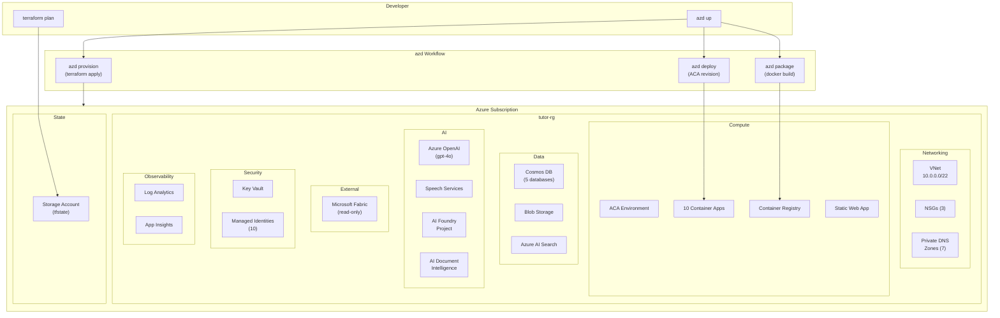

# Infrastructure

> Azure Developer CLI (`azd`) integration with Terraform and Azure Verified Modules (AVM) for **The Tutor** platform.

---

## 1. Infrastructure Overview



---

## 2. Directory Structure

```
infra/
├── terraform/
│   ├── main.tf                           # Root module — composes all sub-modules
│   ├── variables.tf                      # Input variables
│   ├── outputs.tf                        # Output values (for azd)
│   ├── providers.tf                      # azurerm + azapi provider config
│   ├── backend.tf                        # Remote state (Azure Storage)
│   ├── terraform.tfvars.sample           # Example variable values
│   │
│   └── modules/
│       ├── networking/
│       │   ├── main.tf                   # VNet, subnets, NSGs, private DNS
│       │   ├── variables.tf
│       │   └── outputs.tf
│       ├── data/
│       │   ├── main.tf                   # Cosmos DB, Blob Storage, AI Search
│       │   ├── variables.tf
│       │   └── outputs.tf
│       ├── compute/
│       │   ├── main.tf                   # ACA Environment + 10 Container Apps
│       │   ├── variables.tf
│       │   └── outputs.tf
│       ├── ai/
│       │   ├── main.tf                   # OpenAI, Speech, AI Foundry, Document Intelligence
│       │   ├── variables.tf
│       │   └── outputs.tf
│       ├── security/
│       │   ├── main.tf                   # Key Vault, Managed Identities, RBAC
│       │   ├── variables.tf
│       │   └── outputs.tf
│       ├── observability/
│       │   ├── main.tf                   # Log Analytics, App Insights, alerts
│       │   ├── variables.tf
│       │   └── outputs.tf
│       ├── registry/
│       │   ├── main.tf                   # ACR
│       │   ├── variables.tf
│       │   └── outputs.tf
│       └── frontend/
│           ├── main.tf                   # Static Web App
│           ├── variables.tf
│           └── outputs.tf
│
├── bicep/                                # Legacy (preserved for reference)
│   ├── main.bicep
│   └── modules/
│       ├── aca.bicep
│       ├── acr.bicep
│       ├── aoai.bicep
│       ├── cosmos.bicep
│       ├── loga.bicep
│       ├── speech.bicep
│       ├── staticwapp.bicep
│       └── vnet.bicep
│
└── environments/
    ├── dev.tfvars                         # Development environment
    ├── test.tfvars                        # Test / staging environment
    └── prod.tfvars                        # Production environment
```

---

## 3. Azure Verified Modules (AVM)

All Terraform modules use AVM from the [Azure Verified Modules registry](https://registry.terraform.io/namespaces/Azure).

### Module Mapping

| Infrastructure | AVM Module | Source |
|---------------|-----------|--------|
| **Virtual Network** | `avm/res/network/virtual-network` | `Azure/avm-res-network-virtualnetwork/azurerm` |
| **Network Security Group** | `avm/res/network/network-security-group` | `Azure/avm-res-network-networksecuritygroup/azurerm` |
| **Private DNS Zone** | `avm/res/network/private-dns-zone` | `Azure/avm-res-network-privatednszone/azurerm` |
| **Cosmos DB** | `avm/res/document-db/database-account` | `Azure/avm-res-documentdb-databaseaccount/azurerm` |
| **Storage Account** | `avm/res/storage/storage-account` | `Azure/avm-res-storage-storageaccount/azurerm` |
| **Container Registry** | `avm/res/container-registry/registry` | `Azure/avm-res-containerregistry-registry/azurerm` |
| **ACA Environment** | `avm/res/app/managed-environment` | `Azure/avm-res-app-managedenvironment/azurerm` |
| **ACA Container App** | `avm/res/app/container-app` | `Azure/avm-res-app-containerapp/azurerm` |
| **Key Vault** | `avm/res/key-vault/vault` | `Azure/avm-res-keyvault-vault/azurerm` |
| **Log Analytics** | `avm/res/operational-insights/workspace` | `Azure/avm-res-operationalinsights-workspace/azurerm` |
| **App Insights** | `avm/res/insights/component` | `Azure/avm-res-insights-component/azurerm` |
| **Cognitive Services (OpenAI)** | `avm/res/cognitive-services/account` | `Azure/avm-res-cognitiveservices-account/azurerm` |
| **Cognitive Services (Speech)** | `avm/res/cognitive-services/account` | `Azure/avm-res-cognitiveservices-account/azurerm` |
| **Cognitive Services (Document Intelligence)** | `avm/res/cognitive-services/account` | `Azure/avm-res-cognitiveservices-account/azurerm` |
| **AI Search** | `avm/res/search/search-service` | `Azure/avm-res-search-searchservice/azurerm` |
| **Static Web App** | `avm/res/web/static-site` | `Azure/avm-res-web-staticsite/azurerm` |
| **Managed Identity** | `avm/res/managed-identity/user-assigned-identity` | `Azure/avm-res-managedidentity-userassignedidentity/azurerm` |

---

## 4. Sample Terraform Code

### 4.1 Root Module (`main.tf`)

```hcl
# infra/terraform/main.tf

module "networking" {
  source              = "./modules/networking"
  resource_group_name = azurerm_resource_group.main.name
  location            = var.location
  environment         = var.environment
  vnet_address_space  = ["10.0.0.0/22"]
}

module "security" {
  source              = "./modules/security"
  resource_group_name = azurerm_resource_group.main.name
  location            = var.location
  environment         = var.environment
  service_names       = var.service_names
}

module "observability" {
  source              = "./modules/observability"
  resource_group_name = azurerm_resource_group.main.name
  location            = var.location
  environment         = var.environment
  retention_days      = var.log_retention_days
}

module "registry" {
  source              = "./modules/registry"
  resource_group_name = azurerm_resource_group.main.name
  location            = var.location
  environment         = var.environment
  sku                 = "Standard"
}

module "data" {
  source              = "./modules/data"
  resource_group_name = azurerm_resource_group.main.name
  location            = var.location
  environment         = var.environment
  subnet_id           = module.networking.private_endpoint_subnet_id
  databases           = ["platform_db", "assessment_db", "interaction_db", "analytics_db", "supervision_db"]
}

module "ai" {
  source              = "./modules/ai"
  resource_group_name = azurerm_resource_group.main.name
  location            = var.location
  environment         = var.environment
  subnet_id           = module.networking.private_endpoint_subnet_id
  openai_model_name   = var.openai_model_name
  openai_model_version = var.openai_model_version
  openai_capacity     = var.openai_capacity
  enable_document_intelligence = true
  enable_ai_search             = true
}

module "compute" {
  source                  = "./modules/compute"
  resource_group_name     = azurerm_resource_group.main.name
  location                = var.location
  environment             = var.environment
  aca_subnet_id           = module.networking.aca_subnet_id
  log_analytics_id        = module.observability.log_analytics_workspace_id
  acr_login_server        = module.registry.acr_login_server
  services                = var.services
  managed_identity_ids    = module.security.managed_identity_ids
}

module "frontend" {
  source              = "./modules/frontend"
  resource_group_name = azurerm_resource_group.main.name
  location            = var.location
  environment         = var.environment
  repository_url      = var.repository_url
}
```

### 4.2 Compute Module — ACA Container Apps

```hcl
# infra/terraform/modules/compute/main.tf

module "aca_environment" {
  source  = "Azure/avm-res-app-managedenvironment/azurerm"
  version = "~> 0.4"

  name                           = "tutor-aca-env-${var.environment}"
  resource_group_name            = var.resource_group_name
  location                       = var.location
  infrastructure_subnet_id       = var.aca_subnet_id
  log_analytics_workspace_id     = var.log_analytics_id
  internal_load_balancer_enabled = true

  tags = {
    project     = "tutor"
    environment = var.environment
  }
}

module "container_apps" {
  source   = "Azure/avm-res-app-containerapp/azurerm"
  version  = "~> 0.3"
  for_each = var.services

  name                         = "tutor-${each.key}-${var.environment}"
  resource_group_name          = var.resource_group_name
  container_app_environment_id = module.aca_environment.resource_id

  template = {
    containers = [{
      name   = each.key
      image  = "${var.acr_login_server}/${each.key}:latest"
      cpu    = each.value.cpu
      memory = each.value.memory
      env = [{
        name  = "AZURE_CLIENT_ID"
        value = var.managed_identity_ids[each.key]
      }]
    }]
    min_replicas = each.value.min_replicas
    max_replicas = each.value.max_replicas
  }

  ingress = {
    external_enabled = false
    target_port      = each.value.port
    transport        = "http"
  }

  identity = {
    type         = "UserAssigned"
    identity_ids = [var.managed_identity_ids[each.key]]
  }

  tags = {
    project     = "tutor"
    environment = var.environment
    domain      = each.value.domain
  }
}
```

### 4.3 Data Module — Cosmos DB with HPK

```hcl
# infra/terraform/modules/data/main.tf

module "cosmos_db" {
  source  = "Azure/avm-res-documentdb-databaseaccount/azurerm"
  version = "~> 0.6"

  name                = "tutor-cosmos-${var.environment}"
  resource_group_name = var.resource_group_name
  location            = var.location

  kind                     = "GlobalDocumentDB"
  offer_type               = "Standard"
  enable_automatic_failover = var.environment == "prod"

  consistency_policy = {
    consistency_level = "Session"
  }

  sql_databases = {
    for db in var.databases : db => {
      name       = db
      throughput = var.environment == "prod" ? 1000 : 400
    }
  }

  private_endpoints = {
    cosmos_pe = {
      subnet_resource_id = var.subnet_id
      subresource_names  = ["sql"]
    }
  }

  tags = {
    project     = "tutor"
    environment = var.environment
  }
}
```

---

## 5. azd Configuration

### 5.1 `azure.yaml`

```yaml
# azure.yaml (root of repository)
name: tutor
metadata:
  template: tutor@0.2.0

infra:
  provider: terraform
  path: infra/terraform

services:
  # ── Platform Domain ──
  config-svc:
    project: apps/configuration/src
    language: python
    host: containerapp
    docker:
      path: ../../Dockerfile
      context: ../..
    hooks:
      prepackage:
        run: uv pip install --system -e ../../lib

  lms-gateway:
    project: apps/lms-gateway/src
    language: python
    host: containerapp
    docker:
      path: ../../Dockerfile
      context: ../..

  content-svc:
    project: apps/content/src
    language: python
    host: containerapp
    docker:
      path: ../../Dockerfile
      context: ../..

  # ── Assessment Domain ──
  essays-svc:
    project: apps/essays/src
    language: python
    host: containerapp
    docker:
      path: ../../Dockerfile
      context: ../..

  questions-svc:
    project: apps/questions/src
    language: python
    host: containerapp
    docker:
      path: ../../Dockerfile
      context: ../..

  # ── Interaction Domain ──
  avatar-svc:
    project: apps/avatar/src
    language: python
    host: containerapp
    docker:
      path: ../../Dockerfile
      context: ../..

  chat-svc:
    project: apps/chat/src
    language: python
    host: containerapp
    docker:
      path: ../../Dockerfile
      context: ../..

  # ── Analytics Domain ──
  upskilling-svc:
    project: apps/upskilling/src
    language: python
    host: containerapp
    docker:
      path: ../../Dockerfile
      context: ../..

  evaluation-svc:
    project: apps/evaluation/src
    language: python
    host: containerapp
    docker:
      path: ../../Dockerfile
      context: ../..

  # ── Supervision Domain ──
  insights-svc:
    project: apps/insights/src
    language: python
    host: containerapp
    docker:
      path: ../../Dockerfile
      context: ../..

  # ── Frontend ──
  ui:
    project: frontend
    dist: .next
    language: js
    host: staticwebapp
    hooks:
      prepackage:
        run: pnpm install --frozen-lockfile && pnpm build
```

### 5.2 Deployment Commands

```bash
# First-time setup
azd init
azd env set AZURE_ENV_NAME dev
azd env set AZURE_LOCATION eastus2

# Provision infrastructure + deploy all services
azd up

# Deploy a single service
azd deploy config-svc

# Deploy all services without provisioning
azd deploy --all

# Provision infrastructure only
azd provision

# Tear down
azd down --purge
```

### 5.3 CI/CD with GitHub Actions

```yaml
# .github/workflows/deploy.yml
name: Deploy to Azure
on:
  push:
    branches: [main]

permissions:
  id-token: write
  contents: read

jobs:
  deploy:
    runs-on: ubuntu-latest
    environment: production
    steps:
      - uses: actions/checkout@v4

      - name: Install azd
        uses: Azure/setup-azd@v2

      - name: Log in to Azure
        uses: azure/login@v2
        with:
          client-id: ${{ secrets.AZURE_CLIENT_ID }}
          tenant-id: ${{ secrets.AZURE_TENANT_ID }}
          subscription-id: ${{ secrets.AZURE_SUBSCRIPTION_ID }}

      - name: Provision and deploy
        run: azd up --no-prompt
        env:
          AZURE_ENV_NAME: ${{ vars.AZURE_ENV_NAME }}
          AZURE_LOCATION: ${{ vars.AZURE_LOCATION }}
```

---

## 6. Service Configuration

### 6.1 Container App Definitions

```hcl
# variables.tf — service definitions
variable "services" {
  type = map(object({
    port         = number
    cpu          = number
    memory       = string
    min_replicas = number
    max_replicas = number
    domain       = string
  }))
  default = {
    "config-svc" = {
      port = 8081, cpu = 0.25, memory = "0.5Gi"
      min_replicas = 1, max_replicas = 3, domain = "platform"
    }
    "lms-gateway" = {
      port = 8087, cpu = 0.25, memory = "0.5Gi"
      min_replicas = 0, max_replicas = 2, domain = "platform"
    }
    "essays-svc" = {
      port = 8083, cpu = 0.5, memory = "1Gi"
      min_replicas = 0, max_replicas = 5, domain = "assessment"
    }
    "questions-svc" = {
      port = 8082, cpu = 0.5, memory = "1Gi"
      min_replicas = 0, max_replicas = 5, domain = "assessment"
    }
    "avatar-svc" = {
      port = 8084, cpu = 0.5, memory = "1Gi"
      min_replicas = 1, max_replicas = 3, domain = "interaction"
    }
    "chat-svc" = {
      port = 8088, cpu = 0.25, memory = "0.5Gi"
      min_replicas = 0, max_replicas = 3, domain = "interaction"
    }
    "upskilling-svc" = {
      port = 8085, cpu = 0.5, memory = "1Gi"
      min_replicas = 0, max_replicas = 3, domain = "analytics"
    }
    "evaluation-svc" = {
      port = 8086, cpu = 0.5, memory = "1Gi"
      min_replicas = 0, max_replicas = 2, domain = "analytics"
    }
  }
}
```

### 6.2 Environment Variables (per Container App)

| Variable | Source | Services |
|----------|--------|----------|
| `AZURE_CLIENT_ID` | Terraform output (per-service MI) | All |
| `COSMOS_ENDPOINT` | Terraform output | All |
| `OPENAI_ENDPOINT` | Terraform output | Assessment, Interaction |
| `SPEECH_ENDPOINT` | Terraform output | Avatar |
| `BLOB_ENDPOINT` | Terraform output | Essays |
| `KEY_VAULT_URL` | Terraform output | All |
| `AI_PROJECT_CONN` | Key Vault reference | Assessment, Analytics |
| `APP_ENV` | Terraform variable | All |
| `LOG_LEVEL` | Terraform variable | All |

**No secrets in environment variables.** All sensitive values are accessed via Managed Identity or Key Vault references.

---

## 7. Dockerfile Template

All services use a standardized multi-stage Dockerfile:

```dockerfile
# Dockerfile (per service)
FROM python:3.13-slim AS base
WORKDIR /app

# Install lib first for layer caching
COPY lib/ /app/lib/
RUN uv pip install --system --no-cache-dir /app/lib/

# Install service dependencies
COPY apps/<service>/pyproject.toml /app/service/
RUN uv pip install --system --no-cache-dir /app/service/

# Copy service code
COPY apps/<service>/src/ /app/service/src/

# Non-root user
RUN adduser --disabled-password --gecos '' appuser
USER appuser

# Health check
HEALTHCHECK --interval=30s --timeout=5s --retries=3 \
  CMD python -c "import urllib.request; urllib.request.urlopen('http://localhost:<port>/health')"

EXPOSE <port>
CMD ["uvicorn", "app.main:app", "--host", "0.0.0.0", "--port", "<port>"]
```

---

## 8. Migration from Bicep

### Step-by-Step

1. **Preserve existing Bicep** → Move to `infra/bicep/` (done in Phase 3)
2. **Bootstrap Terraform state** → Create state storage account
3. **Write Terraform modules** → Using AVM, one module at a time
4. **Import existing resources** → `terraform import` for each resource
5. **Validate parity** → `terraform plan` should show no changes
6. **Switch CI/CD** → Point pipelines to Terraform
7. **Deprecate Bicep** → Add notice, keep for reference

### Resource Import Commands

```bash
# Import existing resources into Terraform state
terraform import 'azurerm_resource_group.main' '/subscriptions/<sub>/resourceGroups/tutor-rg'
terraform import 'module.data.azurerm_cosmosdb_account.main' '/subscriptions/<sub>/resourceGroups/tutor-rg/providers/Microsoft.DocumentDB/databaseAccounts/tutor-cosmosdb'
terraform import 'module.ai.azurerm_cognitive_account.openai' '/subscriptions/<sub>/resourceGroups/tutor-rg/providers/Microsoft.CognitiveServices/accounts/tutor-openai'
# ... repeat for each resource
```

---

## 9. Remote State Configuration

### 9.1 Backend Config (`backend.tf`)

```hcl
# infra/terraform/backend.tf
terraform {
  backend "azurerm" {
    resource_group_name  = "tutor-state-rg"
    storage_account_name = "tutortfstate"
    container_name       = "tfstate"
    key                  = "tutor.tfstate"
  }
}
```

### 9.2 Bootstrap Script

```bash
#!/bin/bash
# infra/scripts/bootstrap-state.sh — run once to create state backend
az group create -n tutor-state-rg -l eastus2
az storage account create -n tutortfstate -g tutor-state-rg \
  -l eastus2 --sku Standard_LRS --min-tls-version TLS1_2
az storage container create -n tfstate --account-name tutortfstate
```

---

## 10. Development Environment — Cloud-Only Policy

> **No local emulators, docker-compose, or simulated cloud services.**
> All development targets live Azure resources provisioned via `azd`.

### Policy

| Rule | Rationale |
|------|-----------|
| **No `docker-compose.yml`** | All services run as Azure Container Apps; local compose adds drift |
| **No Cosmos DB Emulator** | Use a shared `dev` Cosmos DB account provisioned by Terraform |
| **No simulated AI services** | Azure OpenAI, Document Intelligence, AI Search, and Speech must be real Azure resources |
| **No `APP_ENV=local`** | All environments use `APP_ENV=dev|test|prod` targeting Azure |

### Developer Workflow

1. **`azd up`** — Provisions the `dev` environment (shared Cosmos, OpenAI, AI Search, etc.)
2. **`azd deploy <service>`** — Deploys a single service to the dev ACA environment
3. **Remote debugging** — Attach to ACA via `az containerapp exec` for live troubleshooting
4. **Feature branches** — Use `azd env new feature-xxx` to create isolated dev environments when needed

### Environment Variables

All services consume environment variables injected by ACA from the Terraform-provisioned infrastructure. Developers must **never** hardcode local endpoints.

```python
# ✅ Correct — reads from ACA environment
settings = Settings()  # Pydantic loads from env vars set by Terraform

# ❌ Wrong — hardcoded local emulator
# COSMOS_ENDPOINT = "https://localhost:8081/"
```

---

## 11. Environment Variables (`tfvars`)

### `dev.tfvars`

```hcl
environment         = "dev"
location            = "eastus2"
openai_model_name   = "gpt-4o"
openai_model_version = "2024-11-20"
openai_capacity     = 30
log_retention_days  = 30
repository_url      = "https://github.com/Azure-Samples/tutor"
```

### `prod.tfvars`

```hcl
environment         = "prod"
location            = "eastus2"
openai_model_name   = "gpt-4o"
openai_model_version = "2024-11-20"
openai_capacity     = 120
log_retention_days  = 90
repository_url      = "https://github.com/Azure-Samples/tutor"
```

---

## Related Documents

| Document | Link |
|----------|------|
| ADR-003: ACA Microservices | [003-aca-microservices.md](adr/003-aca-microservices.md) |
| ADR-004: Terraform + AVM | [adr/004-terraform-avm.md](adr/004-terraform-avm.md) |
| ADR-008: Security Layers | [adr/008-security-layers.md](adr/008-security-layers.md) |
| Modernization Plan (Phase 3) | [modernization-plan.md](modernization-plan.md) |
| Security | [security.md](security.md) |
