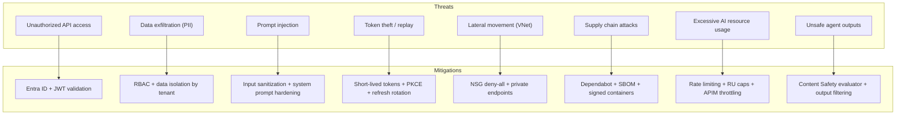
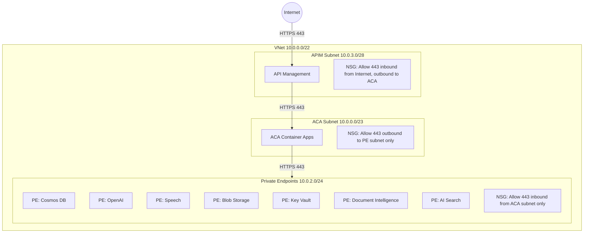
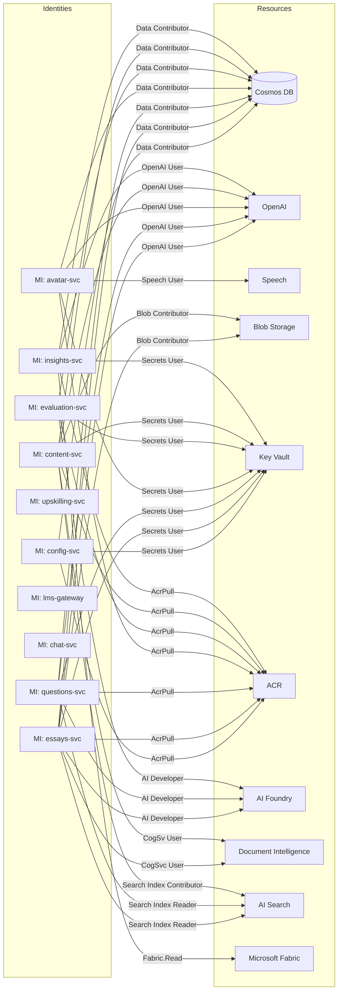

# Security

> Defense-in-depth security architecture for **The Tutor** platform, implementing zero-trust principles across all layers.

---

## 1. Threat Model



---

## 2. Security Architecture Layers

### Layer 1: Identity (Microsoft Entra ID)

| Component | Implementation |
|-----------|---------------|
| **User authentication** | OAuth 2.0 Authorization Code + PKCE via MSAL React |
| **Service authentication** | User-Assigned Managed Identity on each ACA container |
| **Token format** | JWT v2.0 with `roles`, `oid`, `tid` claims |
| **Token lifetime** | Access: 1 hour, Refresh: 24 hours, Sliding session |
| **MFA** | Required via Conditional Access policy |
| **App registration** | Single Entra ID app with app roles: `student`, `professor`, `admin`, `supervisor` |

### Runtime controls for Entra validation

| Variable | Purpose |
|----------|---------|
| `ENTRA_AUTH_ENABLED` | Enables JWT validation middleware (`true`/`false`) |
| `ENTRA_TENANT_ID` | Tenant used to resolve Entra JWKS and issuer |
| `ENTRA_API_CLIENT_ID` | Backend API application ID used to derive audience (`api://<id>`) |
| `ENTRA_TOKEN_AUDIENCE` | Optional explicit audience override |
| `ENTRA_TOKEN_ISSUER` | Optional explicit issuer override |
| `ENTRA_ALLOWED_CLIENT_APP_IDS` | Optional allow-list for `azp`/`appid` claims |

### Stateless session model for agents

All services validate Entra JWTs on every request and avoid server-side session stores. After validation, only request-scoped identity context is propagated to agent workloads:

```json
{
    "subject": "<sub>",
    "tenant_id": "<tid>",
    "object_id": "<oid>",
    "roles": ["student", "professor"]
}
```

This keeps agent execution stateless and prevents cross-request session sharing for data that is not required by the agent.

### Layer 2: Edge Protection

| Control | Configuration |
|---------|--------------|
| **Rate limiting** | 100 requests/minute per user (APIM policy) |
| **Request size** | 10 MB max (essay uploads) |
| **CORS** | SWA origin only (`https://<swa-hostname>.azurestaticapps.net`) |
| **JWT pre-validation** | APIM validates token before routing to backend |
| **IP allowlisting** | Optional per environment (prod: VPN CIDRs only) |
| **WAF** | Azure Front Door WAF (recommended for production) |
| **TLS** | 1.2 minimum, auto-renewed certificates |

### Layer 3: Application Security

| Control | Implementation |
|---------|---------------|
| **RBAC enforcement** | `require_role()` decorator on every endpoint |
| **Input validation** | Pydantic models with strict type checking |
| **Output sanitization** | Strip internal IDs, stack traces, system prompts |
| **Structured logging** | structlog with PII redaction (email → `***@***`) |
| **Error masking** | Generic error messages in production; details in dev |
| **Dependency scanning** | Dependabot for Python + npm vulnerabilities |
| **SAST** | CodeQL on every PR |

### Layer 4: Network Security



| Rule | Source | Destination | Port | Action |
|------|--------|-------------|------|--------|
| Allow APIM → ACA | 10.0.3.0/28 | 10.0.0.0/23 | 443 | Allow |
| Allow ACA → PE | 10.0.0.0/23 | 10.0.2.0/24 | 443 | Allow |
| Deny all inbound to PE | * | 10.0.2.0/24 | * | Deny |
| Deny all inbound to ACA | * | 10.0.0.0/23 | * | Deny |

### Layer 5: Data Security

| Resource | Control | Details |
|----------|---------|---------|
| **Cosmos DB** | RBAC (no master keys) | `Cosmos DB Built-in Data Contributor` per service MI |
| **Cosmos DB** | Encryption at rest | Microsoft-managed keys (CMK optional) |
| **Cosmos DB** | Network | Private endpoint only; public access disabled |
| **Blob Storage** | RBAC | `Storage Blob Data Contributor` per service MI |
| **Blob Storage** | SAS tokens | Short-lived (1 hour), scoped to container + read-only |
| **Key Vault** | RBAC | `Key Vault Secrets User` per service MI |
| **Key Vault** | Soft delete | Enabled, 90-day retention |
| **Key Vault** | Purge protection | Enabled |
| **All data services** | TLS 1.2+ | Enforced on all connections |

### Layer 6: AI Safety

| Control | Implementation |
|---------|---------------|
| **Content Safety** | Azure AI Content Safety evaluator in evaluation pipeline |
| **Prompt injection defense** | System prompt hardening with clear instruction boundaries |
| **Output filtering** | Post-processing to remove any PII echoed in responses |
| **Jailbreak detection** | Foundry evaluator for adversarial prompt detection |
| **Token budget** | Per-request max_tokens limit; per-user daily token cap |
| **Model access** | Azure OpenAI behind private endpoint; no public API key exposure |

---

## 3. RBAC Matrix

| Endpoint | Student | Professor | Admin | Supervisor |
|----------|---------|-----------|-------|------------|
| `GET /config/courses` | ✅ (enrolled) | ✅ (teaching) | ✅ (all) | ❌ |
| `POST /config/courses` | ❌ | ✅ | ✅ | ❌ |
| `GET /config/pedagogical-rules` | ❌ | ✅ (course) | ✅ (all) | ❌ |
| `PUT /config/pedagogical-rules` | ❌ | ✅ | ✅ | ❌ |
| `GET /config/feature-flags` | ❌ | ❌ | ✅ | ❌ |
| `PUT /config/feature-flags` | ❌ | ❌ | ✅ | ❌ |
| `POST /essays/submit` | ✅ | ❌ | ✅ | ❌ |
| `GET /essays/evaluations` | ✅ (own) | ✅ (course) | ✅ (all) | ❌ |
| `POST /questions/interaction` | ✅ | ❌ | ✅ | ❌ |
| `POST /avatar/session` | ✅ | ✅ | ✅ | ❌ |
| `PUT /avatar/config` | ❌ | ✅ | ✅ | ❌ |
| `POST /chat/session` | ✅ | ❌ | ✅ | ❌ |
| `GET /upskilling/analyze` | ✅ (own) | ✅ (course) | ✅ (all) | ❌ |
| `POST /evaluation/run` | ❌ | ✅ | ✅ | ❌ |
| `GET /evaluation/runs` | ❌ | ✅ (own) | ✅ (all) | ❌ |
| `POST /lms/sync` | ❌ | ❌ | ✅ | ❌ |
| `GET /lms/status` | ❌ | ✅ | ✅ | ❌ |
| `POST /content/upload` | ❌ | ✅ | ✅ | ❌ |
| `GET /content/materials` | ❌ | ✅ | ✅ | ❌ |
| `GET /insights/reports` | ❌ | ❌ | ✅ (all) | ✅ (school-scoped) |
| `POST /insights/generate` | ❌ | ❌ | ✅ | ✅ (school-scoped) |
| `GET /insights/indicators` | ❌ | ❌ | ✅ (all) | ✅ (school-scoped) |
| `PUT /insights/indicator-config` | ❌ | ❌ | ✅ | ❌ |

### Supervisor Data Scoping (BN-SUP-5)

The `supervisor` role has **school-scoped access**. Unlike other roles that use `tenantId` for data isolation, supervisors access data scoped to their assigned schools:

| Claim | Source | Purpose |
|-------|--------|---------|
| `roles: ["supervisor"]` | Entra ID App Role | Route access control |
| `school_ids: [...]` | Entra ID Groups / Microsoft Graph API | Data scoping — supervisor only sees data for assigned schools |

insights-svc validates school access on every request:

```python
@require_role("supervisor")
async def get_report(school_id: str, user: AuthenticatedUser):
    if school_id not in user.school_ids:
        raise HTTPException(403, "No access to this school")
    return await insight_service.get_report(school_id)
```

---

## 4. Managed Identity Assignments



---

## 5. Security Checklist

### Pre-Production

- [ ] Entra ID app registration with app roles configured
- [ ] JWT validation middleware enabled on all services
- [ ] RBAC decorators applied to all endpoints
- [ ] Managed Identity assigned to all ACA container apps
- [ ] All Azure resources behind private endpoints
- [ ] NSG rules enforced (deny-all-inbound + specific allows)
- [ ] Key Vault soft delete and purge protection enabled
- [ ] Connection strings removed from all environment variables
- [ ] Content-Security-Policy headers on frontend
- [ ] CORS restricted to SWA origin
- [ ] Dependabot enabled for Python and npm
- [ ] CodeQL SAST enabled in CI
- [ ] Diagnostic settings enabled on all resources
- [ ] Alert rules configured for auth failures and error spikes
- [ ] Content Safety evaluator in evaluation pipeline
- [ ] Container images signed and pulled from private ACR

### Post-Production (Ongoing)

- [ ] Monthly dependency vulnerability review
- [ ] Quarterly penetration testing
- [ ] Annual security architecture review
- [ ] Continuous monitoring via Azure Security Center
- [ ] Incident response plan tested semi-annually
