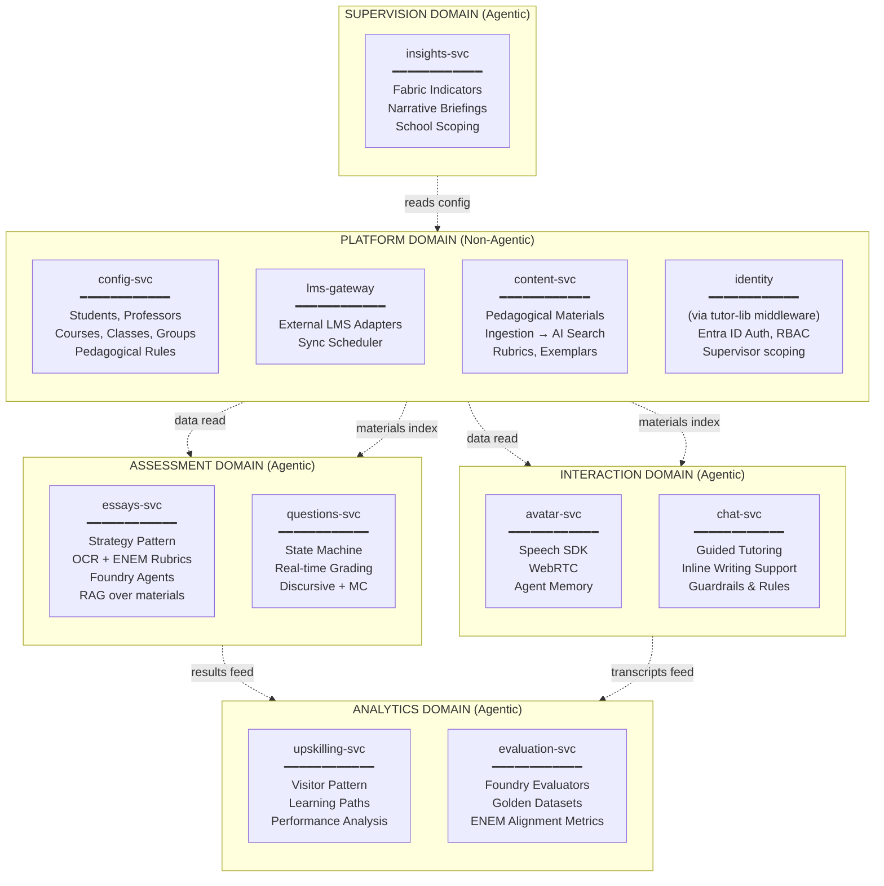
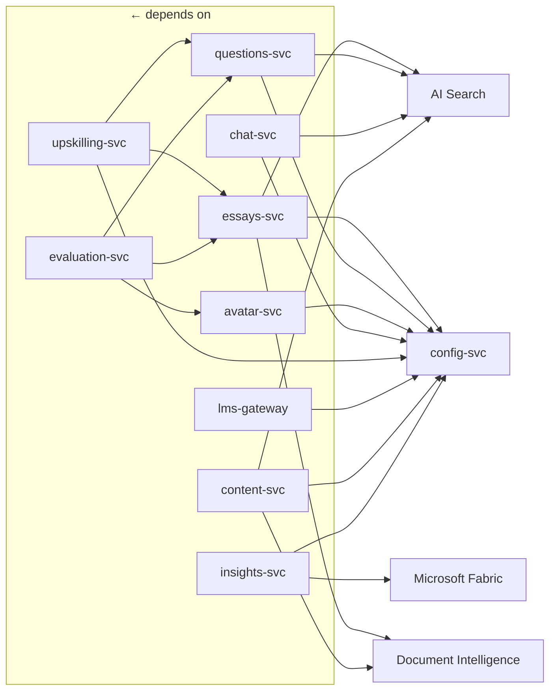
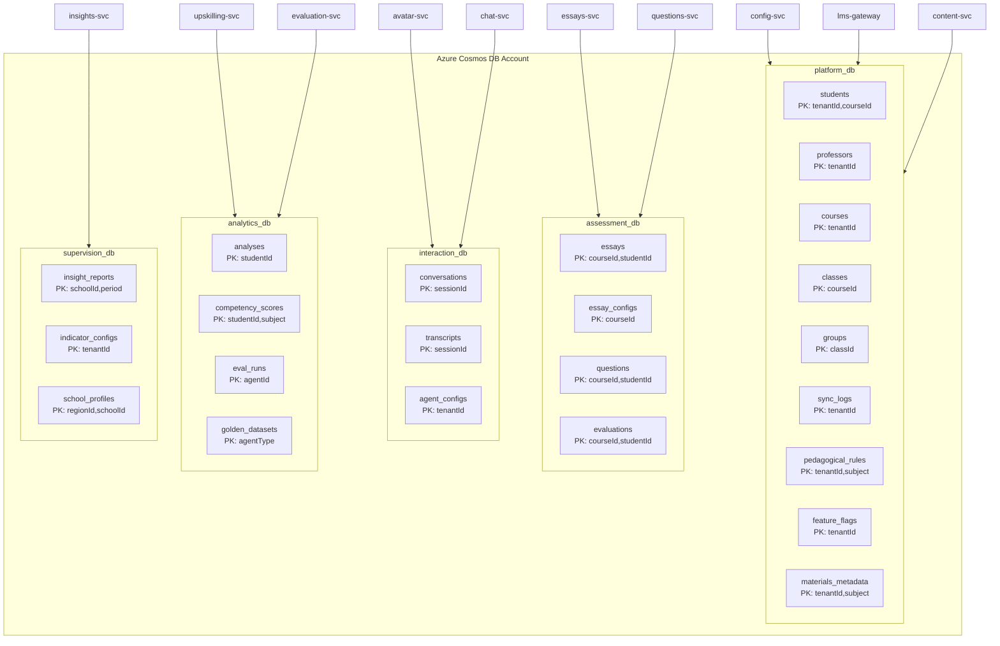

# Service Domains

> Business-domain decomposition of **The Tutor** platform, defining clear ownership boundaries between agentic and non-agentic services. Aligned with the Supervisor Insights and Pedagogical business agendas.

---

## 1. Domain Map



---

## 2. Domain Definitions

### 2.1 Platform Domain (Non-Agentic)

**Purpose**: Core data management, external integrations, content ingestion, and identity. No AI inference occurs in this domain.

**Why non-agentic?**
- CRUD operations are deterministic — no LLM needed
- LMS sync is data transformation — adapters, not agents
- Content ingestion uses Document Intelligence and AI Search (no agent orchestration)
- Identity is framework-level — middleware, not a service

#### config-svc

| Aspect | Detail |
|--------|--------|
| **Responsibility** | CRUD for students, professors, courses, classes, groups, **pedagogical rules** |
| **Port** | 8081 |
| **Data owned** | `platform_db`: students, professors, courses, classes, groups, **pedagogical_rules**, **feature_flags** |
| **Depends on** | Cosmos DB |
| **Called by** | All other services (to resolve student/course context and pedagogical rules) |
| **Scaling** | min: 1, max: 3 (steady, low-CPU) |
| **Patterns** | Repository pattern with CosmosCRUD base |
| **Business Need** | BN-PED-5 (configurable rules), BN-PED-6 (pilot feature flags), BN-SUP-5 (governance) |

#### lms-gateway

| Aspect | Detail |
|--------|--------|
| **Responsibility** | External LMS sync (Moodle, Canvas, and custom adapters) |
| **Port** | 8087 |
| **Data owned** | `platform_db`: sync_logs |
| **Depends on** | Cosmos DB, External LMS APIs, config-svc |
| **Called by** | Timer trigger, admin manual trigger |
| **Scaling** | min: 0, max: 2 (burst during sync, idle otherwise) |
| **Patterns** | Adapter pattern, Scheduler |

#### content-svc (NEW)

| Aspect | Detail |
|--------|--------|
| **Responsibility** | Pedagogical material ingestion, OCR extraction, AI Search indexing for RAG |
| **Port** | 8089 |
| **Data owned** | `platform_db`: materials |
| **Depends on** | Azure Blob Storage, Azure AI Document Intelligence, Azure AI Search, Cosmos DB |
| **Called by** | Frontend (teachers upload materials), Assessment/Interaction services (query AI Search) |
| **Scaling** | min: 0, max: 2 (burst during uploads, idle otherwise) |
| **Patterns** | Pipeline pattern: Upload → Extract → Chunk → Index |
| **Business Need** | BN-PED-2 (curated material ingestion for AI grounding) |

### 2.2 Assessment Domain (Agentic)

**Purpose**: Evaluate student submissions (essays, questions) using AI agents with OCR support, ENEM rubric alignment, and RAG over pedagogical materials.

#### essays-svc

| Aspect | Detail |
|--------|--------|
| **Responsibility** | Essay submission, OCR for handwritten essays, strategy-based evaluation with ENEM alignment, Foundry agent provisioning |
| **Port** | 8083 |
| **Data owned** | `assessment_db`: essays, essay_configs |
| **Depends on** | Cosmos DB, Blob Storage, Azure AI Foundry, AI Document Intelligence (OCR — Phase A: SDK in service, Phase B: via tutor-lib), AI Search (RAG — Phase B), config-svc (pedagogical rules) |
| **Called by** | Frontend (students submit essays), evaluation-svc |
| **Scaling** | min: 0, max: 5 (token-heavy, medium latency) |
| **Patterns** | Strategy (ENEM/Analytical/Narrative/Default — Phase B), Orchestrator |
| **Business Need** | BN-PED-1 (AI essay correction with OCR + ENEM rubrics) |

> **Phase A (issue #18, branch `feat/ocr-essay-ingestion`)**: Document Intelligence SDK wired directly into `apps/essays/src/app/file_processing.py`. Introduces `DocumentIntelligenceConfig` in `config.py`. Falls back to `pypdf`/PIL when `DOCUMENT_INTELLIGENCE_ENDPOINT` is unset (local development). ENEM strategy and RAG remain pending (Phase B).

#### questions-svc

| Aspect | Detail |
|--------|--------|
| **Responsibility** | Real-time question grading with state machine pipeline; supports both multiple-choice and discursive questions |
| **Port** | 8082 |
| **Data owned** | `assessment_db`: questions, evaluations |
| **Depends on** | Cosmos DB, Azure AI Foundry, AI Search (RAG for discursive), config-svc (pedagogical rules) |
| **Called by** | Frontend (debounced as student types), evaluation-svc |
| **Scaling** | min: 0, max: 5 (low-latency required, high concurrency) |
| **Patterns** | State Machine (Pending → Evaluating → Completed), DiscursiveState for open-ended |
| **Business Need** | BN-PED-1 (AI question correction) |

### 2.3 Interaction Domain (Agentic)

**Purpose**: Real-time conversational experiences (voice and text) with AI tutors. The chat service functions as a **guided tutor** embedded in the writing experience, not a generic chatbot.

#### avatar-svc

| Aspect | Detail |
|--------|--------|
| **Responsibility** | Speech-driven avatar tutoring with WebRTC |
| **Port** | 8084 |
| **Data owned** | `interaction_db`: conversations, transcripts, agent_configs |
| **Depends on** | Cosmos DB, Azure OpenAI, Azure Speech, config-svc |
| **Called by** | Frontend (WebRTC sessions) |
| **Scaling** | min: 1, max: 3 (always-on for WebRTC, connection-based) |
| **Patterns** | Agent + Speech pipeline |
| **Business Need** | BN-PED-3 (virtual tutor/mentor) |

#### chat-svc (NEW — Guided Tutor)

| Aspect | Detail |
|--------|--------|
| **Responsibility** | Guided text tutoring embedded in essay/question pages; provides hints, feedback, and pedagogical prompts during writing — never gives direct answers |
| **Port** | 8088 |
| **Data owned** | `interaction_db`: conversations (shared with avatar) |
| **Depends on** | Cosmos DB, Azure OpenAI, AI Search (RAG for pedagogical context), config-svc (pedagogical rules: guardrails, triggers, limits) |
| **Called by** | Frontend (inline in essay/question pages) |
| **Scaling** | min: 0, max: 3 (session-based) |
| **Patterns** | Conversational agent with RAG, guardrail enforcement, proactive triggers |
| **Business Need** | BN-PED-3 (virtual tutor during writing), BN-PED-5 (configurable rules and guardrails) |

### 2.4 Analytics Domain (Agentic)

**Purpose**: Analyze learning outcomes, evaluate agent quality, and measure ENEM competency alignment.

#### upskilling-svc

| Aspect | Detail |
|--------|--------|
| **Responsibility** | Student performance analysis, learning path recommendations, ENEM competency alignment metrics |
| **Port** | 8085 |
| **Data owned** | `analytics_db`: analyses, competency_scores |
| **Depends on** | Cosmos DB, Azure AI Foundry, essays-svc, questions-svc |
| **Called by** | Frontend (professor dashboard, supervisor dashboard) |
| **Scaling** | min: 0, max: 3 (batch, async) |
| **Patterns** | Visitor (Performance, ContentComplexity, GuidanceCoach, ENEMAlignment) |
| **Business Need** | BN-PED-6 (pilot validation metrics for 3rd-year physics) |

#### evaluation-svc (NEW)

| Aspect | Detail |
|--------|--------|
| **Responsibility** | Agent quality evaluation using Foundry evaluators; ENEM rubric fidelity checks |
| **Port** | 8086 |
| **Data owned** | `analytics_db`: eval_runs, golden_datasets |
| **Depends on** | Cosmos DB, Azure AI Foundry, all agentic services |
| **Called by** | Admin (manual), CI/CD (automated), Scheduler (nightly) |
| **Scaling** | min: 0, max: 2 (batch, high token usage) |
| **Patterns** | Evaluator pipeline, Golden dataset management, ENEM competency evaluators |
| **Business Need** | BN-PED-1 (ENEM rubric fidelity), BN-PED-6 (pilot validation metrics) |

### 2.5 Supervision Domain (Agentic) — NEW

**Purpose**: Generate actionable insight reports for regional supervisors by consuming educational indicators from Microsoft Fabric and synthesizing narrative briefings via Azure OpenAI.

#### insights-svc (NEW)

| Aspect | Detail |
|--------|--------|
| **Responsibility** | Consume Fabric semantic model indicators (standardized assessments, attendance, task completion), run narrative synthesis via Azure OpenAI, generate per-school briefing reports |
| **Port** | 8090 |
| **Data owned** | `supervision_db`: insight_reports, indicator_configs, school_profiles |
| **Depends on** | Microsoft Fabric (read-only semantic model via REST), Azure OpenAI, Cosmos DB, config-svc (school ↔ supervisor mapping) |
| **Called by** | Frontend (supervisor dashboard), Scheduler (weekly pre-visit briefing) |
| **Scaling** | min: 0, max: 3 (burst before supervisor visits) |
| **Patterns** | Strategy per indicator type (StandardizedTestStrategy, AttendanceStrategy, TaskCompletionStrategy), narrative synthesis pipeline, school-scoped data isolation |
| **Business Need** | BN-SUP-1 (automated insights), BN-SUP-2 (pre-visit briefings), BN-SUP-3 (modular indicators), BN-SUP-4 (supervisor UX validation) |

**Indicator Strategy Pattern**:

```python
class IndicatorStrategy(ABC):
    @abstractmethod
    async def fetch(self, school_id: str, period: str) -> IndicatorData: ...
    @abstractmethod
    async def summarize(self, data: IndicatorData) -> str: ...

class StandardizedTestStrategy(IndicatorStrategy): ...    # Reads from Fabric semantic model
class AttendanceStrategy(IndicatorStrategy): ... # Reads from Fabric semantic model
class TaskCompletionStrategy(IndicatorStrategy): ... # Reads from external LMS via Fabric
```

**Report Generation Flow**:

1. Scheduler or supervisor triggers report for a school
2. insights-svc fetches configured indicators via their strategies
3. Each strategy queries Fabric REST API for its slice of the semantic model
4. Raw data is assembled into a structured payload
5. Azure OpenAI synthesizes a Strava-like narrative report
6. Report is stored in `supervision_db.insight_reports` with school partition key
7. Supervisor accesses the report via the frontend dashboard

---

## 3. Inter-Service Communication Contract

All communication is **synchronous REST** over ACA internal DNS. Each service exposes a health endpoint and a versioned API.

```
Service DNS pattern: <service-name>.<aca-env-name>.internal
Example: config-svc.tutor-aca-env.internal:8081
```

### API Contract Rules

1. **No direct database cross-reads** — Services call each other's APIs, never query another service's Cosmos containers.
2. **Response envelope** — All responses use `ApiEnvelope<T>` from `tutor-lib`.
3. **Error propagation** — Upstream errors return the original status code + detail.
4. **Idempotency** — All write operations support idempotency keys.
5. **Versioning** — `/api/v1/` prefix on all routes; breaking changes go to `/api/v2/`.

### Dependency Graph



---

## 4. Migration from Current to Target

### What Stays

| Service | Changes |
|---------|---------|
| **config-svc** | Remove agent configs (→ assessment domain), remove cases/steps (→ assessment domain) |
| **essays-svc** | Keep as-is, update imports to `tutor-lib` |
| **questions-svc** | Move from `app/` to `src/app/`, update imports to `tutor-lib` |
| **avatar-svc** | Extract text chat → `chat-svc`, add avatar config persistence |
| **upskilling-svc** | Move from `app/` to `src/app/`, update imports to `tutor-lib` |

### What's New

| Service | Origin |
|---------|--------|
| **chat-svc** | Extracted from avatar-svc (text-only guided tutoring) |
| **evaluation-svc** | New service for Foundry evaluation + ENEM rubric fidelity |
| **lms-gateway** | New service for external LMS sync |
| **content-svc** | New service for pedagogical material ingestion (OCR + AI Search RAG) |
| **insights-svc** | New service for supervisor insight reports (Fabric indicators + narrative synthesis) |

### What's Removed

| Component | Reason |
|-----------|--------|
| `common/` module references | Replaced by `tutor-lib` |
| `tutor.egg-info/` | Stale artifact from monolithic layout |
| Duplicated `config.py` across services | Consolidated in `tutor-lib` |
| Duplicated `agents/*.py` across services | Consolidated in `tutor-lib` |

---

## 5. Cosmos DB Container Ownership

Each domain gets its own logical database to enforce data isolation:



All partition keys use **Hierarchical Partition Keys** (HPK) where two levels are shown (e.g., `tenantId,courseId`), following Cosmos DB best practices to avoid the 20 GB single-partition limit and optimize cross-partition queries.
