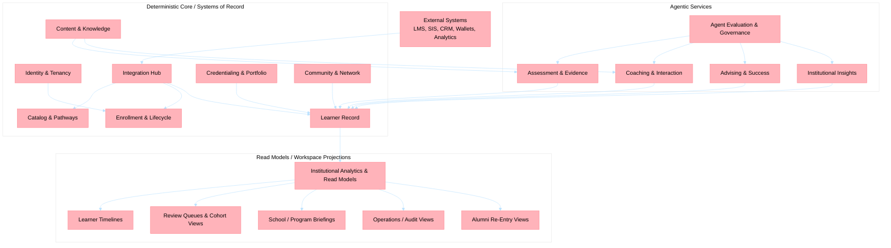

# Service Domains

> Business-domain decomposition of **The Tutor** as a learner-record-centered standalone lifelong-learning platform. The deterministic core owns the systems of record and governance boundaries; agentic services contribute high-value reasoning and append governed evidence back into the learner record.

---

## 1. Domain Map

---

## 2. Domain Definitions

The target platform uses DDD bounded contexts. Several of these contexts can begin as modules inside existing services or shared libraries and become dedicated services only when ownership, governance, or scale requires it.

| Bounded context | Type | Owns | Current repo anchor |
| ---------------- | ---- | ---- | ------------------- |
| **Identity and Tenancy** | Deterministic core | Institution, school, program, user, alumni, and relationship scope used for authorization and lifecycle policy. | Shared Entra/JWT middleware plus configuration data today. |
| **Integration Hub** | Deterministic core | Anti-corruption layers, canonical import/export contracts, sync audit, and schema normalization for LMS, SIS, CRM, analytics, and wallet ecosystems. | `lms-gateway` and the current Fabric/LMS adapter patterns. |
| **Catalog and Pathways** | Deterministic core | Program catalog, pathway definitions, milestones, curriculum graph, and offering structure. | Future context; partially implied by configuration data today. |
| **Enrollment and Lifecycle** | Deterministic core | Affiliations, cohort membership, enrollment state, institution relationships, and alumni transitions. | `config-svc` plus LMS sync today. |
| **Learner Record** | Deterministic core | Append-only history of learning, assessment, tutoring, advising, credential, and community events with provenance. | Future context; initially projected from current services. |
| **Content and Knowledge** | Deterministic core | Approved content corpus, rubrics, exemplars, pedagogical rules, and grounding policies. | `content-svc` and `config-svc`. |
| **Assessment and Evidence** | Agentic service | Draft evaluations, rubric-grounded evidence, feedback artifacts, and submission-specific evidence links. | `essays-svc` and `questions-svc`. |
| **Coaching and Interaction** | Agentic service | Guided tutoring, hinting, session transcripts, and interaction summaries. | `avatar-svc` and `chat-svc`. |
| **Advising and Success** | Hybrid context | Advising cases, recommended interventions, next-best actions, and success summaries. | `upskilling-svc` today; future advising core later. |
| **Credentialing and Portfolio** | Deterministic core | Credential definitions, eligibility, awards, verification, revocation, and portfolio artifacts. | Future context. |
| **Community and Network** | Deterministic core | Groups, mentoring links, alumni/community membership, and moderation state. | Future context. |
| **Institutional Analytics and Read Models** | Projection context | Learner, cohort, school, and program projections for workspaces and interventions. | `insights-svc` plus future read-model projections. |
| **Agent Evaluation and Governance** | Governance context | Evaluation datasets, policy gates, provenance contracts, degraded-mode policy, and release approval for high-impact AI features. | `evaluation-svc` and [agent-evaluation.md](./agent-evaluation.md). |

---

## 3. System-of-Record Boundaries

All external data enters Tutor through the **Integration Hub**. After normalization, every durable record belongs to exactly one bounded context, even if multiple services contribute derived evidence or read models.

| Product area | Target source of truth | Migration-era external authority | Boundary rule |
| ------------ | ---------------------- | -------------------------------- | ------------- |
| **Identity and relationship scope** | Identity and Tenancy + Enrollment and Lifecycle | Entra ID, LMS/SIS rosters, institutional directories | Role plus relationship checks must be enforced at API and query layers; no service-local override becomes authoritative. |
| **Program, catalog, and pathway structure** | Catalog and Pathways | LMS/SIS catalogs until imported | External schemas are normalized through anti-corruption layers before they affect internal models. |
| **Learner affiliations and enrollment state** | Enrollment and Lifecycle | LMS/SIS/registrar during migration | Agentic services may read normalized context but do not own authoritative roster state. |
| **Learner history and evidence timeline** | Learner Record | Current services backfill through normalized events | The record is append-oriented; corrections are compensating entries, not destructive overwrites. |
| **Rubrics, exemplars, and grounded knowledge** | Content and Knowledge | Approved LMS/file repositories if imported | Only approved content can ground assessment, tutoring, or advising outputs. |
| **Assessment outcomes** | Assessment and Evidence for draft workflow; Learner Record for durable history | LMS gradebooks may receive published results | High-impact scoring remains human-reviewable and must carry provenance. |
| **Advising interventions** | Advising and Success | CRM notes or case tools during migration | Agentic recommendations remain advisory until a human confirms the action. |
| **Credentials and portfolio artifacts** | Credentialing and Portfolio | External wallets and verifier ecosystems distribute only | Issuance, verification, revocation, and minimal-PII policy stay inside Tutor. |
| **Community and mentorship relationships** | Community and Network | Alumni CRM/community systems during migration | Lifecycle separation and moderation state are required. |
| **Institutional projections and briefings** | Institutional Analytics and Read Models | Fabric, CRM, and LMS analytics may seed projections | Projections are read models, never the authoritative write model. |
| **Safety, evaluation, and provenance policy** | Agent Evaluation and Governance | None | High-impact features do not ship without provenance coverage, evaluation evidence, and degraded-mode policy. |

---

## 4. Integration, CQRS, and Workspace Rules

| Rule | Pattern guidance | Practical implication |
| ---- | ---------------- | --------------------- |
| **External integration uses anti-corruption layers** | DDD Anti-Corruption Layer | LMS, SIS, CRM, analytics, and wallet schema changes are isolated inside the Integration Hub. |
| **Migration follows Strangler Fig** | Strangler Fig pattern | Current services remain the runtime substrate while learner-record-centered contexts are introduced wave by wave. |
| **The learner record is append-oriented** | Append-only record and event-backbone thinking | Durable educational history is never rewritten in place; provenance and corrections remain visible. |
| **Read models follow CQRS thinking** | CQRS / projection pattern | Role workspaces read optimized projections such as timelines, work queues, and briefings instead of querying write models directly. |
| **Workspace routing is strategy-driven** | Strategy and data-driven routing | Role, relationship, lifecycle state, and feature flags determine which modules, queues, and actions a user sees. |
| **Agentic services operate inside a governance envelope** | NIST AI RMF-aligned control boundary | No autonomous high-impact educational action is allowed; degraded mode is explicit and auditable. |
| **No cross-context database reads** | DDD ownership rule | Services and contexts integrate through APIs, events, and normalized contracts rather than shared container access. |

---

## 5. Current Repo Mapping and Migration

| Current repo asset | Target bounded contexts it advances | Wave fit | Notes |
| ------------------ | ----------------------------------- | -------- | ----- |
| **config-svc** | Identity and Tenancy (partial), Enrollment and Lifecycle, Content and Knowledge (rules/flags) | Wave 1 | Transitional control-plane service until learner-record-centered contexts are separated further. |
| **lms-gateway** | Integration Hub | Wave 1 | The existing adapter model becomes the anti-corruption seam for LMS first, then SIS/CRM later. |
| **content-svc** | Content and Knowledge | Wave 1 / Wave 2 | Owns approved corpora and grounding policy for assessment and tutoring. |
| **essays-svc + questions-svc** | Assessment and Evidence | Wave 1 | Continue generating draft evaluations and evidence, then append governed outcomes into the learner record. |
| **avatar-svc + chat-svc** | Coaching and Interaction | Wave 1 / Wave 2 | Stay in coaching mode and feed transcripts and evidence into governed projections. |
| **upskilling-svc** | Advising and Success (early), Institutional Analytics and Read Models (partial) | Wave 2 | Evolves from analysis toward advising cases, interventions, and next-best-action workflows. |
| **insights-svc** | Institutional Analytics and Read Models plus narrative institutional insights | Wave 2 | Narrative briefings sit on top of deterministic projections and scope controls. |
| **evaluation-svc** | Agent Evaluation and Governance | Wave 1 | Becomes the release gate for provenance, evaluation, and degraded-mode policy on high-impact AI. |
| **Future learner-record context** | Learner Record | Wave 1 | Can start as an append-only event and projection layer before a dedicated service is justified. |
| **Future catalog/pathways, credentials, and community contexts** | Catalog and Pathways, Credentialing and Portfolio, Community and Network | Waves 2-3 | These contexts can begin inside existing services or shared libraries and split later when ownership or scale requires it. |

Dedicated services are optional until domain ownership, operational load, or governance pressure makes a split necessary. The bounded contexts above are the architectural contract; the current service mesh is the transitional implementation.
