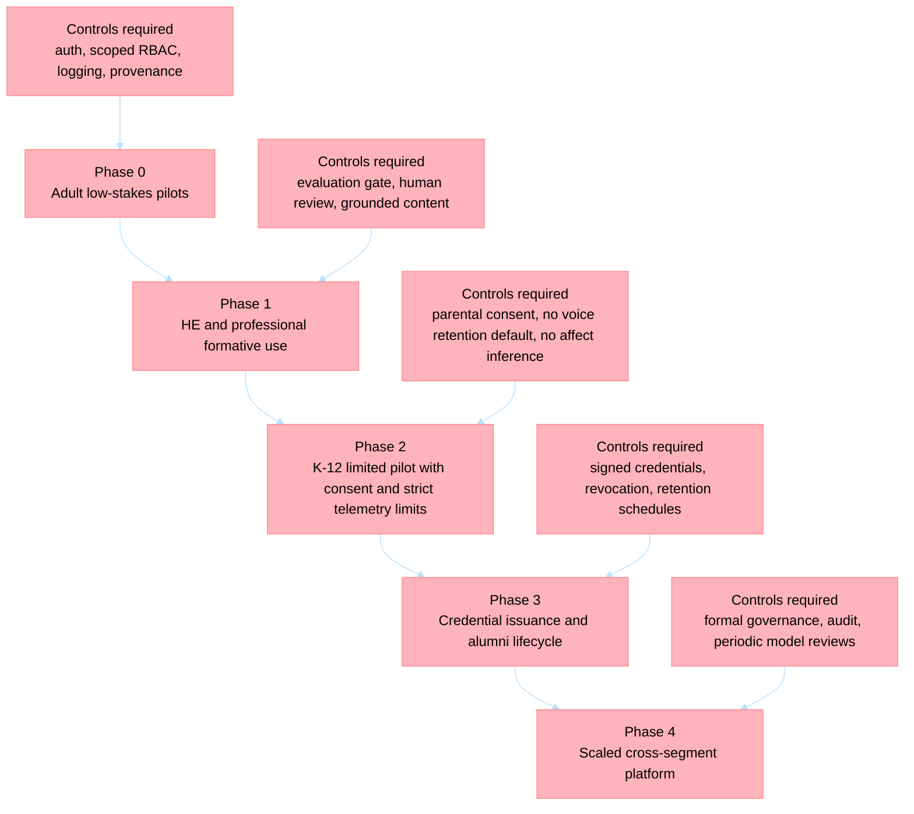

# Standalone Lifelong Learning Platform Risk Assessment

## Scope And Method

This assessment covers the expansion of The Tutor from an LMS enhancer into a standalone lifelong-learning and performance-tracking platform spanning K-12, higher education, professional education, and alumni.

Methodology:

- ISO 31000-style risk identification and treatment
- NIST AI RMF for agentic and generative AI risks
- Regulatory mapping to FERPA, COPPA, GDPR, and the EU AI Act

Assumption:

- Risk appetite is conservative because the target scope includes minors, learner records, and potentially high-impact educational decisions.

Architecture anchors already present in this repo:

- Shared Entra/JWT middleware and role checks in [lib/src/tutor_lib/middleware/auth.py](../lib/src/tutor_lib/middleware/auth.py) and [lib/src/tutor_lib/config/app_factory.py](../lib/src/tutor_lib/config/app_factory.py)
- Supervisor school scoping and pilot allowlists in [apps/insights/src/app/main.py](../apps/insights/src/app/main.py)
- Evaluation service and golden-dataset pattern in [docs/agent-evaluation.md](./agent-evaluation.md)
- Content ingestion, OCR, RAG, and pedagogical rules in [docs/adr/010-pedagogical-content-ocr.md](./adr/010-pedagogical-content-ocr.md)
- Zero-trust target architecture in [docs/security.md](./security.md) and [docs/adr/008-security-layers.md](./adr/008-security-layers.md)

Current-state caution:

- Backend auth exists as a shared capability but is environment-gated by `ENTRA_AUTH_ENABLED`, which defaults to `false` in [lib/src/tutor_lib/config/settings.py](../lib/src/tutor_lib/config/settings.py).
- Frontend MSAL and protected routes are still planned work in [docs/adr/007-frontend-modernization.md](./adr/007-frontend-modernization.md).
- Some assessment paths intentionally return degraded fallback feedback when orchestration fails in [apps/questions/app/main.py](../apps/questions/app/main.py) and [apps/essays/src/app/main.py](../apps/essays/src/app/main.py).

## Risk Register

Scoring:

- Likelihood: 1 rare, 5 almost certain
- Severity: 1 low, 5 critical
- Exposure: likelihood × severity

| ID | Risk | Category | Likelihood | Severity | Exposure | Why it matters for standalone education | Repo-compatible mitigation pattern |
| --- | --- | --- | ---: | ---: | ---: | --- | --- |
| R1 | Identity or scope failure exposes learner records across student, teacher, supervisor, admin, guardian, or alumni contexts | Privacy, governance, technical | 4 | 5 | 20 | Standalone operation removes the LMS as the sole access boundary. Cross-school, cross-course, or cross-lifecycle leakage becomes materially more likely once the platform owns the system of engagement. | Enforce Entra auth everywhere, require role plus relationship scope plus institution scope, extend claims to school and course membership, remove legacy header fallback in managed environments, keep school-scope enforcement patterns from insights-svc, and keep service-to-service access through APIs rather than cross-container reads |
| R2 | AI assessment unfairness or scoring drift harms learners through incorrect grades, feedback, or progression signals | Safety, fairness, regulatory | 4 | 5 | 20 | Essay and discursive grading are high-impact education uses. Errors can affect placement, remediation, confidence, and institutional trust. | Treat summative scoring as high-risk. Use evaluation-svc golden datasets, rubric-alignment evaluators, subgroup slices by subject and learner segment, required human review for grade-affecting outputs, and appeals plus override workflows |
| R3 | Minor and K-12 privacy failure, especially for chat, avatar, voice, and behavioral telemetry | Privacy, safety, regulatory | 4 | 5 | 20 | K-12 data is materially more sensitive. Voice tutoring and continuous interaction create richer behavioral traces than conventional LMS events. | Add age-segmented policies in config-svc, parental consent flow, minimal telemetry defaults, no voice retention by default, no third-party analytics on student sessions, and no emotion-inference features |
| R4 | Agentic recommendations become de facto decisions on remediation, intervention, progression, or student opportunity | Safety, governance, market | 4 | 4 | 16 | In education, “recommendation” often becomes operational truth when staff are overloaded. That creates covert automation risk even without formal auto-approval. | Hard policy boundary: agents assist but do not decide. Require staff confirmation for interventions that affect placement, grading, credentials, discipline, or access to services. Show confidence and rationale, never silent auto-action |
| R5 | Alumni data retention becomes indefinite and disproportionate | Privacy, governance, operational | 4 | 4 | 16 | A lifelong-learning platform creates strong pressure to keep full historical records forever. That raises GDPR-style minimization, FERPA transition, and reputational risk. | Separate active learner, alumni, and credential evidence domains; publish retention schedules; implement export, delete, archive, and legal-hold workflows; store only the minimum profile needed for post-completion services |
| R6 | Credential issuance, verification, or revocation is weak, creating fraud or stale records | Governance, operational, market | 3 | 5 | 15 | If the platform issues micro-credentials or performance attestations, integrity failures can directly affect academic and employment outcomes. | Create a dedicated credential domain with issuer roles, append-only audit events, signed credentials, verifier endpoint, revocation registry, and minimal claims payloads |
| R7 | Fallback or hallucinated feedback is presented as authoritative educational guidance | Safety, technical | 4 | 4 | 16 | The current repo already contains degraded fallback behavior for essays and questions. In a standalone platform, users may treat fallback output as official guidance unless clearly labeled. | Add explicit degraded-mode UX, suppress scores and progression recommendations during fallback, persist a reliability flag with each output, and route degraded results to human review or re-run queues |
| R8 | Role-based access is implemented at authentication level but not consistently at endpoint and data-query level | Governance, technical | 4 | 4 | 16 | Authentication without per-endpoint scope checks is not sufficient for multi-persona education systems. This becomes acute for credentials, assessment runs, and admin tooling. | Extend `require_roles` usage to all mutating and sensitive read endpoints, add resource-level checks for ownership and school/course scope, and test with negative authorization cases in CI |
| R9 | RAG poisoning, stale content, or low-quality source material degrades educational outputs | Safety, operational | 3 | 4 | 12 | In a grounded tutoring system, bad source material becomes a scaled teaching error. | Use content-svc approval workflow, teacher or admin-only publishing, source versioning, expiry or recertification dates, and evaluator checks for groundedness against approved material only |
| R10 | Weak provenance and auditability makes it impossible to explain who saw what, why an output was generated, or which model and content were used | Governance, regulatory, operational | 3 | 5 | 15 | Education disputes require traceability. Without provenance, appeals, incident review, and compliance review become brittle. | Persist agent_id, model deployment, prompt version, source_ids, evaluator scores, actor identity, and decision state for every high-impact output |
| R11 | Cross-lifecycle data modeling causes unnecessary joins, hot partitions, or mixed-purpose records that are hard to secure or delete | Technical, privacy, operational | 3 | 4 | 12 | A standalone platform spanning K-12, HE, professional, and alumni records will naturally drift toward oversized mixed documents unless domain boundaries are explicit. | Keep domain-separate Cosmos containers, use schema versioning, keep items well below 2 MB, and adopt hierarchical partition keys aligned to institution and learner query patterns |
| R12 | Market and trust failure from opaque AI usage in education | Market, reputational, governance | 3 | 4 | 12 | Institutions, parents, and learners will reject the platform if they cannot understand where AI is used and what remains under human control. | Publish plain-language AI notices, opt-in pilot participation, role-specific transparency UI, and institution-facing governance documentation |

## Top 5 Risks Requiring Design-Time Controls

These five should not be deferred to post-launch monitoring. They need architectural controls before feature work expands.

| Rank | Risk | Why it is design-time, not operational-only | Required control |
| --- | --- | --- | --- |
| 1 | R1 identity and scope failure | Access scope must be baked into the domain model, token claims, and query patterns. Retrofitting later is expensive and error-prone. | Role plus attribute-based access control using institution, school, course, learner relationship, and lifecycle status |
| 2 | R2 AI assessment unfairness | High-impact grading and discursive evaluation require quality and fairness controls before students see production output. | Evaluation gate in evaluation-svc, human review for high-stakes use, rubric versioning, and formal appeal paths |
| 3 | R3 minor and K-12 privacy | Consent, retention, and telemetry defaults must be built into the product architecture. | K-12 mode, parental consent, minimal telemetry, no voice retention default, no emotion recognition, and guardian-aware access patterns |
| 4 | R4 agentic recommendation overreach | Product affordances determine whether staff interpret AI as advisory or authoritative. | Explicit decision boundary, human confirmation steps, confidence display, and no autonomous actions on learner status |
| 5 | R6 credential integrity | Credential trust depends on issuance, verification, and revocation architecture from day one. | Dedicated credential domain, signed artifacts, verifier API, audit trail, and issuer separation of duties |

## Highest-Risk AI-Agent Areas In Education Specifically

1. Assessment and scoring. The EU AI Act identifies AI used in education, including exam scoring, as high-risk and subjects such systems to stronger controls around dataset quality, logging, documentation, human oversight, robustness, and accuracy.
2. Minor interaction data. Chat and avatar tutoring for children can accumulate sensitive longitudinal behavioral data, including voice, writing patterns, confidence cues, and intervention history.
3. Hidden automation of educator judgment. Even if the system only outputs “recommendations,” overloaded staff can operationalize them as decisions on remediation, risk flags, or credentialing.
4. Fairness in open-ended evaluation. Discursive and essay grading are substantially harder to calibrate than objective scoring, especially across grade bands, languages, dialects, and accommodations.
5. Biometric and affective drift. Education is a prohibited or highly sensitive setting for certain AI practices such as emotion recognition in the EU AI Act. Avatar features must not evolve into affect inference.

## Guardrails And Policy Recommendations

### Product Guardrails

- AI outputs that affect grades, progression, remediation assignment, or credentials must be labeled as draft recommendations until approved by an authorized human.
- Degraded or fallback runs must not generate numeric scores, risk labels, or credential recommendations.
- Guided tutor and avatar agents must stay in hint or coaching mode and must not provide direct answers where the learning design prohibits it.
- High-impact outputs must show provenance: rubric version, source material, evaluator status, model deployment, and timestamp.
- Student-facing AI should default to approved RAG sources only, not open-ended generation without institutional grounding.

### Privacy And Data Policies

- Create separate retention schedules for minors, active adult learners, alumni, and credential evidence.
- Define a legal basis and disclosure model for each data class: learner record, interaction transcript, audio, derived performance signal, and credential artifact.
- Make audio retention opt-in for K-12 and default to transient processing only.
- Treat derived risk scores, remediation labels, and behavioral summaries as sensitive educational records, not mere product telemetry.

### Governance Policies

- Maintain a model and prompt change log with release approval tied to evaluation results.
- Require a risk review for any feature that touches minors, credentials, assessment, or cross-institution analytics.
- Add an educator appeal and override process for contested AI evaluations.
- Publish institution-facing transparency notices describing where AI is used, what data is retained, and what human oversight exists.

## Risks That Should Shape Issue Scoping And Rollout

### Issue Scoping Rules

Every new issue should declare a risk class.

| Risk Class | Trigger | Required artifacts before implementation starts |
| --- | --- | --- |
| Class A | Minors, grades, credentials, role expansion, or cross-school analytics | Threat model, privacy review, data retention decision, evaluation plan, rollout flag, and owner for human review workflow |
| Class B | Teacher-facing recommendations, alumni analytics, performance-tracking summaries, or new RAG corpora | Grounding plan, provenance fields, monitoring plan, and limited pilot scope |
| Class C | Low-sensitivity admin UX or internal tooling with no new sensitive data | Standard engineering review and observability checklist |

### Rollout Phases

Recommended sequencing:

1. Start with adult or professional low-stakes formative experiences.
2. Add higher education and professional recommendation features only after evaluation and provenance gates are live.
3. Enter K-12 only with explicit consent, stricter telemetry defaults, and no automated high-stakes outcomes.
4. Add credentials and alumni features only after lifecycle separation, revocation, and retention workflows exist.
5. Scale across segments only after periodic fairness, safety, and authorization reviews are operationalized.

## Repo-Compatible Mitigation Patterns

| Need | Pattern that fits this repo |
| --- | --- |
| Multi-persona access control | Extend shared Entra middleware and `require_roles`, then add attribute checks based on school, course, institution, guardian relationship, and alumni status |
| Pilot containment | Reuse feature flags and the pilot allowlist pattern already present in insights-svc |
| AI behavior control | Store pedagogical rules and guardrails in config-svc and enforce them in chat, avatar, essays, and questions |
| Fairness and safety gating | Use evaluation-svc golden datasets plus custom evaluators for rubric alignment, discursive accuracy, ENEM fidelity, and guardrail compliance |
| Grounded generation | Use content-svc and AI Search as the approved source of pedagogical truth for assessment and tutoring |
| Data isolation in Cosmos | Keep domain-separated containers and use hierarchical partition keys aligned to institution and learner query patterns to avoid unsafe cross-partition joins |
| Auditability | Persist agent references, model deployments, source ids, evaluator outcomes, and actor identity alongside high-impact outputs |

## External Sources Consulted

- U.S. Department of Education, FERPA overview: https://studentprivacy.ed.gov/faq/what-ferpa
- U.S. FTC, COPPA guidance hub: https://www.ftc.gov/business-guidance/privacy-security/childrens-privacy
- NIST AI Risk Management Framework: https://www.nist.gov/itl/ai-risk-management-framework
- GDPR text and article map: https://gdpr-info.eu/
- European Commission AI Act overview: https://digital-strategy.ec.europa.eu/en/policies/regulatory-framework-ai

## Bottom Line

The expansion is viable, but only if The Tutor is treated as a high-governance educational system rather than a generic AI learning product. The largest risks are not model quality alone. They are identity scope, assessment fairness, minor privacy, covert automation of educator judgment, and long-term record governance.